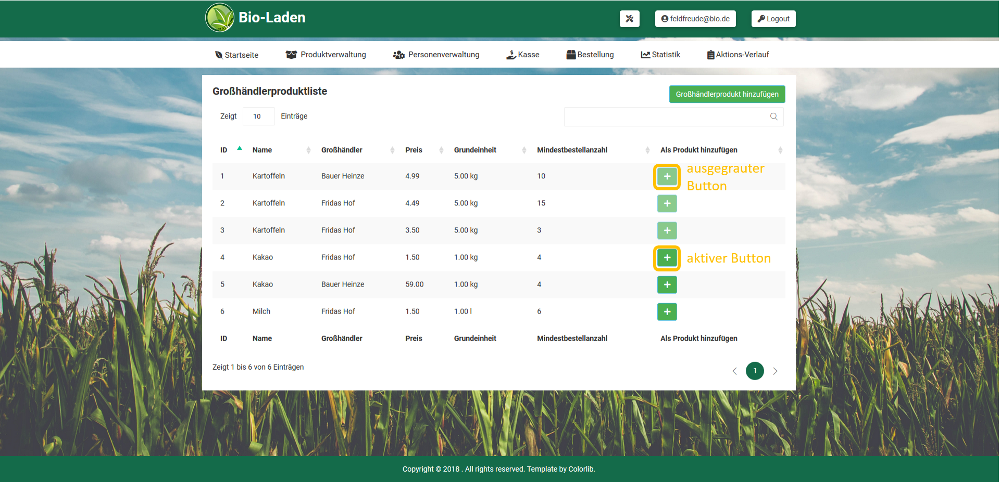
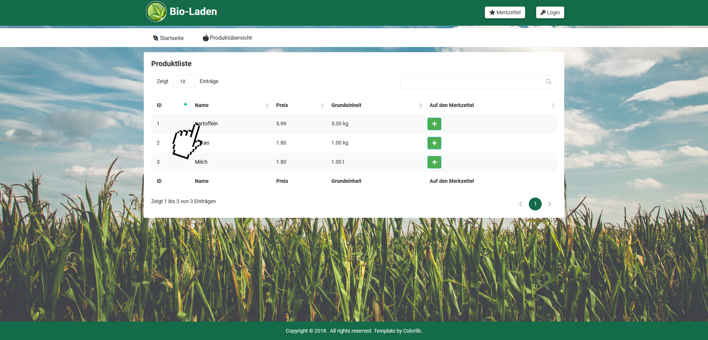
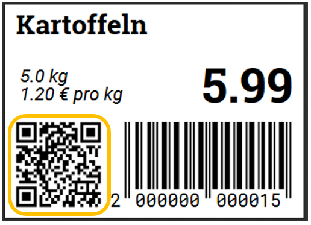

// SETTINGS \\

:doctype: book

// -- Table of Contents

:toc:
:toclevels: 3
:toc-title: Inhaltsverzeichnis
:toc-placement!:

// -- Icons

ifdef::env-github[]

:caution-caption: :fire:
:important-caption: :exclamation:
:note-caption: :paperclip:
:tip-caption: :bulb:
:warning-caption: :warning:
endif::[]

ifdef::env-github[]
:status:
:outfilesuffix: .adoc
endif::[]

:sectanchors:
:numbered:

// -- Variables
:project_name: Bioladen :seedling:

= Anwenderdoku __{project_name}__

toc::[]

== Anmerkung
In diesem Dokument sind eventuelle Unklarheiten zur Bedienung der Anwendung erläutert.

== Navigation
Unangemeldete Nutzer der Anwendungen erhalten nur Zugriff auf folgende Punkte:
[options="header"]
[cols="1, 1"]
|===
|Navigation |Beschreibung

|Startseite
|man kommt zur Startseite der Anwendungen, bei der man sich auch für Newletter anmelden kann

|Produktübersicht
|Nutzer erhält eine Übersicht aller angebotener Artikel

|Merkzettel
|Nutzer kann sich seine ausgewählten Produkte aus der Produktübersicht anschauen und vorläufige Kosten kalkulieren

|Login
|Manager und Verkaufspersonal können sich dort mit ihren Daten anmelden um mehr Zugriff zu erhalten
|===

Das Verkaufspersonal erhält nach Login folgende Navigationspunkte:

[options="header"]
[cols="1, 1"]
|===
|Navigation |Beschreibung

|Startseite
|man kommt zur Startseite der Anwendungen, bei der man sich auch für Newletter anmelden kann

|Produktverwaltung
|Übersicht für Großhändlerprodukte und angebotene Produkte

|Personenverwaltung
|Überssicht von Kunden und Großhändlern

|Kasse
|Kassensystem für das Abrechnen der Kunden

|Nutzereinstellung
|Möglichkeit Passwort zu ändern

|Logout
|Verkaufspersonal wird ausgeloggt (Rechte werden wieder entzogen) und gelangt automatisch zur Startseite
|===

Der Manger erhält nach Login folgende Navigationspunkte:
[options="header"]
[cols="1, 1"]
|===
|Navigation |Beschreibung

|Startseite
|man kommt zur Startseite der Anwendungen, bei der man sich auch für Newletter anmelden kann

|Produktverwaltung
|Übersicht für Großhändlerprodukte und angebotene Produkte

|Personenverwaltung
|Überssicht von Kunden und Großhändlern, sowie hinzufügen dieser

|Kasse
|Kassensystem für das Abrechnen der Kunden

|Bestellung
|Möglichkeit Bestellungen abzuschicken und Übersicht der Bestellten Artikel einzusehen

|Statistik
|Diagramme und Zahlen, z.B Neuanmeldungen, Ausgaben ...

|Aktions-Verlauf
|zeigt Historie der Anwendung an

|Werkzeug-Emoji
|Newletter schreiben und Gewinnprozentsatz ändern

|Nutzereinstellung
|Möglichkeit Passwort zu ändern

|Logout
|Manager wird ausgeloggt (Rechte werden wieder entzogen) und gelangt automatisch zur Startseite
|===

== Großhändlerproduktliste

Großhändlerprodukte, wie zum Beispiel hier die Kartoffel können nicht mehr zu den Produkten hinzu gefügt werden, da es sich bereits in der Produktliste befindet.
Der Knopf dafür kann deshalb nicht mehr betätigt werden (ausgerauter Button).

== Produktseiten
Zu den Produktseiten kann man über zwei Wege gelangen:

Weg 1: man klickt in der Produktliste auf den Names des Produktes

⠀

Weg 2: Einscannen des QR-Codes vom Label

== Kasse
=== Allgemeines
(1) Wurden Werte, wie in das Kunden-ID Feld eingeben, (2) muss die Eingabe erst mit dem Häkchen bestätigt werden , (3) damit eine Ausgabe (z.B Prozentsatz) erfolgen kann.

=== Einscannen von Produkten
Die Anwendung stellt die Funtkion zur Verfügung Barcodes einzuscannen, und somit eine erleichtere Bedienung der Kasse für das Personal zu ermöglichen.
Dafür müssen folgende Schritte durchgeführt werden:

1. öffnen Sie die Kasse und klicken sie auf "QR-Code anzeigen"
2. scannen Sie mit ihrem Smartphone den QR-Code ein und schließen das Fenster mit dem QR-Code (erlauben Sie den Zugriff auf die Kamera bitte)
3. scannen Sie nun den Barcode des Labels mithilfe des Smartphones, die ID des Produktes sollte nun markierten Feld erscheinen

[NOTE]
 Dafür mussen beide Geräte im selben Netzwerk, indem einem Kommunikation ziwschen den Geräten erlaubt ist, befinden

== Personenverwaltung - User hinzufügen
Wird eine neue Person mit der Rolle Manager oder Personal erstellt, kann sich nun das neue Personal mit seiner angegebenen Email und dem Standardpassword "blattgrün43" anmelden. Das Passwort kann vom Nutzer später selbst unter Nutzereinstellungen ändern.

== Aktionsverlauf

Im Aktionsverlauf kann der Manager alle Aktivitäten der Anwendungen sehen. Dabei stehen die neusten Elemente oben. Zur besseren Erfassung, können die Elemente aus und eingeklappt werden.
Links wird mithilfe der farblichen Leiste und eines Emoji dargestellt, was passiert ist:

grün - hinzugefügt +
rot - gelöscht +
orange - modifiziert (modifizierte Zeile wird nochmals farbig hervor gehoben)

