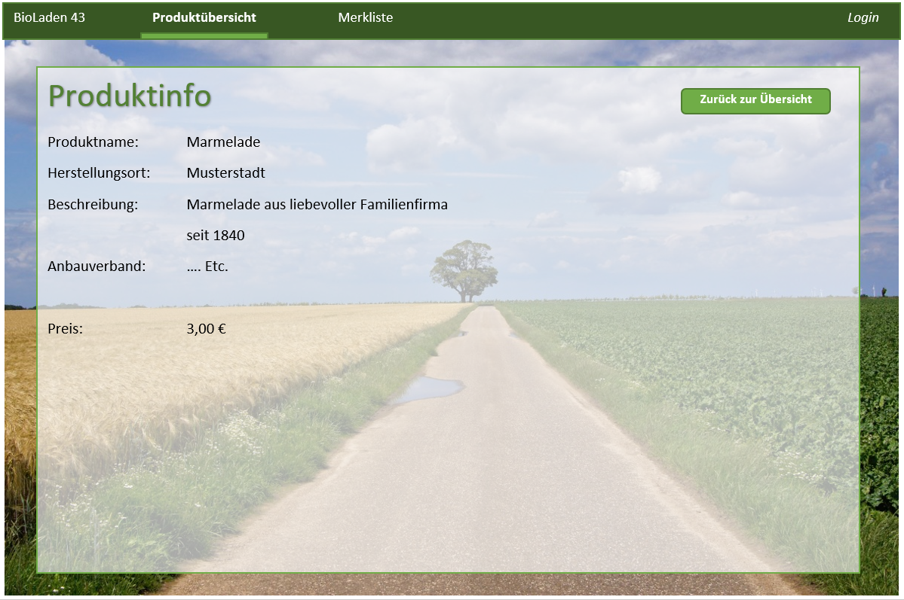
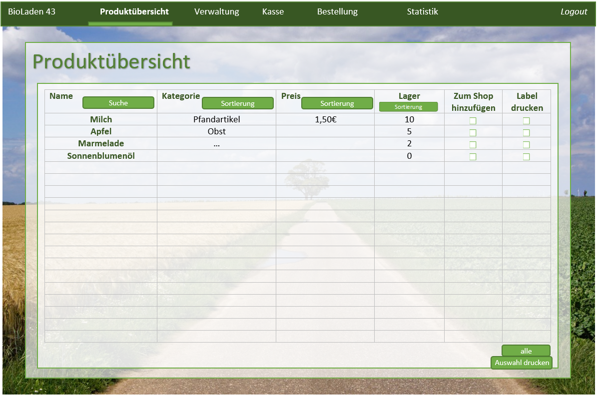
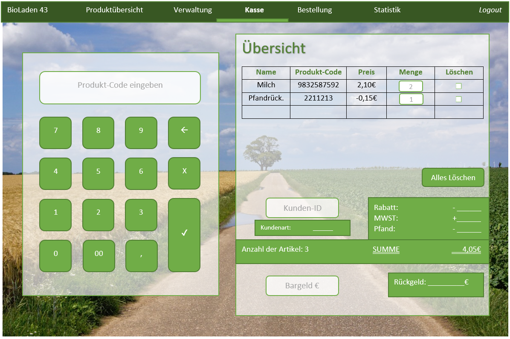

// SETTINGS \\

:doctype: book

// -- Table of Contents

:toc:
:toclevels: 3
:toc-title: Inhaltsverzeichnis
:toc-placement!:

// -- Icons

ifdef::env-github[]

:caution-caption: :fire:
:important-caption: :exclamation:
:note-caption: :paperclip:
:tip-caption: :bulb:
:warning-caption: :warning:
endif::[]

ifdef::env-github[]
:status:
:outfilesuffix: .adoc
endif::[]

:sectanchors:
:numbered:

// -- Variables
:project_name: Bioladen :seedling:

= Entwicklerdokumentation {project_name}

toc::[]

== Einführung und Ziele
=== Aufgabenstellung
Für die Abwicklung unserer Geschäftsvorgänge ist ein Warenwirtschaftssystem zu
erstellen, welches verschiedene Datenbanken miteinander verknüpft.  +

So soll eine Einkaufsdatenbank alle lieferbaren Produkte unserer Zulieferer beinhalten.
Grundlage bildet dabei das BNN-Format, welches alle wichtigen Informationen zu den
Produkten vorsieht. Die entsprechenden Kataloge (mit bis zu 10000 Artikeln) können
durch Import von Listen der Grosshändler in die Datenbank gelangen. Beachten Sie
bitte, dass mehrere Grosshändler die gleichen Produkte führen, oft mit differierenden
Preisen. Da wir auch Produkte anbieten, die von Grosshändlern stammen, welche keine
Produktkataloge im BNN-Format zur Verfügung stellen, muss die manuelle Eingabe
weiterer Artikel mit für uns wesentlichen Produktinformationen möglich sein. Der
gesamte Bereich der Einkaufsdatenbank ist vor Einsichtnahme durch das
Verkaufspersonal zu schützen. +

Für die Organisation unserer Einkäufe und die Herstellung von Transparenz für die
Kunden ist eine Lieferantendatenbank notwendig. Diese bietet uns die Möglichkeit auf
Adressen, Telefonnummern, Ansprechpartner, Mindestbestellwerte, Zahlungsmodi,
Steuernummern usw. zurückzugreifen. Der Zugriff auf die Lieferantendatenbank ist für
das Verkaufspersonal nur eingeschränkt zu ermöglichen (Lieferantenname, Ort). +

Da wir eine Vielzahl Kunden bedienen, die unterschiedliche Konditionen erhalten,
benötigt unser Warenwirtschaftssystem auch eine Kundendatei. Diese soll die
Zuordnung der Kunden zu Gruppen ermöglichen (Normalkunden, Personal,
Großhandelsabnehmer, Hauskunden). Ferner soll die Kundendatei für Marketingzwecke
e-mail-Adressen, Wohn- bzw. Geschäftsadresse, Telefonnummern und die Vorliebe für
bestimmte Produkte bereithalten. Die Eingabe von Normalkundendaten ist für das
Verkaufspersonal möglich. Alle anderen Kundenzuordnungen erfolgen durch die
Geschäftsleitung. +

Kernstück des Warenwirtschaftssystems ist die Verkaufsdatenbank. Die von uns für den
Verkauf aus der Einkaufsdatenbank ausgewählten Artikel finden hier ihren Platz.
Beachten Sie bitte, dass diese zur Verarbeitung des alltäglichen Verkaufs nicht alle
lieferbaren Produkte umfassen muss. Priorität hat der schnelle Zugriff auf die Artikel (bis
zu 999). Für die Verkaufsdatenbank müssen die Preise für unterschiedliche
Kundengruppen kalkuliert werden. Für die Zeitersparnis bei der Kalkulation der
Verkaufspreise soll global kalkuliert werden können. Ferner soll die Kalkulation für
unterschiedliche Warengruppen und einzelne Artikel möglich sein. Als geeignet für
letztere erweist sich eine Darstellung in einer Merkliste, in die die zu kalkulierenden
Artikel vor der Kalkulation nach unterschiedlichen Gesichtspunkten sortiert werden, um
anschliessend wiederum global kalkuliert werden zu können. Die Auswahl der Artikel für
die Verkaufsdatenbank und die Kalkulation bleibt der Geschäftsleitung vorbehalten. Im
Handel allgemein und auch bei uns sind ausgewählte Produkte in Pfandartikeln verpackt.
Im Verkauf müssen also bestimmte Produkte mit Pfandartikeln verknüpft werden. +

Da wir der Preisauszeichnungspflicht unterworfen sind, soll unser
Warenwirtschaftssystem den Etikettendruck unterstützen. Ferner dienen Etiketten zurErfassung von Bestellvorgängen. Folgende Angaben sind dabei unabdingbar:
Produktname, Produktgrösse, Preis (für auszuwählende Kundengruppe),
Grundpreiseinheit, Grundpreis und EAN (Barcode). Nützlich sind Angaben, wie
Anbauverband (Bioland, Naturland, GÄA usw.), Lieferant, Sollstückzahl). +

Der wesentliche Bestandteil unseres Geschäftes besteht im Tausch von Produkten
gegen Bargeld mit unseren Kunden. Diese wählen einen Artikel aus, der durch den
Verkauf in deren Besitz übergeht. Entsprechend muss der jeweilige Artikel aus unserem
Bestand ausgebucht werden. Gleichzeitig bekommen wir dafür Bargeld, welches
unterschiedlichen Mehrwertsteuersätzen unterworfen ist. Auch dieses muss (nach
Steuersätzen getrennt) verbucht werden. Die Kassierfunktion unserer Warenwirtschaft
soll so einzelne oder mehrere Artikel erfassen. Dabei ist jede Waren- oder
Geldbewegung zu archivieren und einer einfachen statistischen Auswertung zugänglich
zu machen. Beachten Sie bitte, dass die Kassierfunktion sowohl die Addition von
Artikelwerten als auch die Subtraktion von zurückgegebenen Pfandwerten ermöglichen
muss. Auch die Multiplikation von Artikeln (etwa 6*Milch) sollte möglich sein. Nach
Eingabe aller vom Kunden gewünschter Artikel, wird der Verkaufsvorgang mit der
Bezahlung abgeschlossen. Um das Verkaufspersonal zu entlasten, ist es notwendig, die
Wechselgeldsumme unter Zuhilfenahme der vom Kunden übergebenen Summe durch
die Kasse zu berechnen und anzuzeigen. Wird innerhalb eines unabgeschlossenen
Verkaufsvorganges eine Rückbuchung vorgenommen, so handelt es sich dabei um eine
einfache Stornierung. Eine globale Stornierung — etwa, weil ein Kunde kein Geld bei
sich hat — sollte ebenfalls schnell möglich sein. Jegliche Stornierungen müssen
archiviert werden. +

Für die Feststellung der sich im Laden befindlichen Werte sind Inventuren notwendig.
Ein Wertvergleich von eingekaufter Ware, die bei Lieferung eingebucht wird, verkaufter
Ware und bei der Inventur vorhandener Ware liefert Inventurdifferenzen, die
aussagekräftig für Diebstahlsaufkommen sind. Zudem ist die Feststellung des
Warenwertes zum Wechsel des Wirtschaftsjahres vorgeschrieben. +

Der Bestellvorgang erfolgt für alle im Laden befindlichen Artikel auf einmal.
Anschliessend werden die Bestellungen für die einzelnen Anbieter ausgegeben. Die
Einkaufshilfe unseres Warenwirtschaftssystems ermöglicht es für gleiche Produkte von
unterschiedlichen Grosshändlern den günstigsten Anbieter auszuwählen. +

Als Zusatzaufgabe möchten wir wesentliche Erfassungen (Einbuchung bei
Wareneingang, Kassierfunktion, Inventuren) über einen Barcodescanner realisiert
wissen.

=== Qualitätsziele

In der nachfolgenden Tabelle wird dokumentiert, welche Qualitätsziele von der Software erfüllt werden müssen.
Außerdem wird die Priorität der einzelnen Ziele festgehalten. (1 - unwichtig  ->  5 - sehr wichtig)

[options="header"]
[cols="2h,^1,^1,^1,^1,^1"]
|===
|Qualitätsziel
|1
|2
|3
|4
|5

|Wartbarkeit (Maintainability)
|
|
|X
|
|

|Erweiterbarkeit (Extensibility)
|
|
|
|
|X

|Benutzbarkeit (Usability)
|
|
|X
|
|

|Anpassbarkeit (Scalability)
|X
|
|
|
|

|Zuverlässigkeit (Reliability)
|
|
|
|
|X

|Sicherheit (Security)
|
|
|
|X
|

|Geschwindigkeit (Performance)
|
|
|
|X
|

|===

== Randbedingungen
=== Hardware-Vorgaben
Das System sollte auf einem durchschnittlichen Business PC laufen können, damit möglichst alle Kunden auf die Website zugreifen können. +
Außerdem muss das System flüssig auch auf den Kassen und für das Personal dargestellt werden. +
Genaue Vorgaben liegen nicht vor.

=== Software-Vorgaben
Das System sollte auf den aktuellen Browsern (Firefox und Chrome) einwandfrei funktionieren.
Abwärtskompatibilität kann nicht garantiert werden.

=== Vorgaben zum Betrieb der Software
Die Software wird rund um die Uhr betrieben, um die Website den Kunden zugänglich zu machen.

== Kontextabgrenzung
=== Externe Schnittstellen

== Lösungsstrategie
Kurzer Überblick über Ihre grundlegenden Entscheidungen und Lösungsansätze, die jeder, der mit der Architektur zu tun hat, verstanden haben sollte.

== Bausteinsicht
=== Package-Diagramm
image::/models/design/PackageDiagram.svg[]

== Entwurfsentscheidungen
=== Architektur

=== Verwendete Muster

=== Persistenz

=== Benutzeroberfläche

[[start_image]]
image::GUI_Entwurf/startseite.PNG[startseite, 100%, 100%, pdfwidth=100%, title= "Startseite von {project_name}", align=center]

[[produktuebersicht_image]]
image::GUI_Entwurf/produktuebersicht_kunde.PNG[Produktübersicht, 100%, 100%, pdfwidth=100%, title= "Produktübersicht von {project_name} aus Sicht des Kunden", align=center]

[[produktinfo_image]]

[[merkliste_image]]
image::GUI_Entwurf/merkliste.PNG[Merkliste, 100%, 100%, pdfwidth=100%, title= "Merkliste in {project_name}", align=center]

[[login_image]]
image::GUI_Entwurf/loginstart.PNG[Login, 100%, 100%, pdfwidth=100%, title= "Loginseiten für Personal in {project_name}", align=center]

[[erfolgreicherlogin_image]]
image::GUI_Entwurf/login.PNG[Mangaer eingeloggt, 100%, 100%, pdfwidth=100%, title= "erfolgreicher Login für Manager in {project_name}", align=center]

[[produktuebersichtmanager_image]]

[[verwaltung_image]]
image::GUI_Entwurf/verwaltung.PNG[Verwaltung, 100%, 100%, pdfwidth=100%, title= "Verwaltungsübersicht in {project_name}", align=center]

[[userhin_image]]
image::GUI_Entwurf/user_hinzufuegen.PNG[Userhinzufuegen, 100%, 100%, pdfwidth=100%, title= "neue Kundenkatei in {project_name} anlegen", align=center]

[[userver_image]]
image::GUI_Entwurf/user_verwalten.PNG[Userverwalten, 100%, 100%, pdfwidth=100%, title= "Nutzer verwalten in {project_name}", align=center]

[[bnn_image]]
image::GUI_Entwurf/bnn.PNG[BNN, 100%, 100%, pdfwidth=100%, title= "Ganze Listen im BNN-Format importieren in {project_name}", align=center]

[[produktmanuell_image]]
image::GUI_Entwurf/produkt_manuell.PNG[Produktmanuell, 100%, 100%, pdfwidth=100%, title= "Produkte manuell in die Datenbank hinzufügen in {project_name}", align=center]

[[kasse_image]]

[[bestellung_image]]
image::GUI_Entwurf/bestellung.PNG[Bestellung, 100%, 100%, pdfwidth=100%, title= "Bestellsystem in {project_name}", align=center]

[[statistik_image]]
image::GUI_Entwurf/statistik.PNG[Statistik, 100%, 100%, pdfwidth=100%, title= "Statistikübersicht in {project_name}", align=center]

[[testlabel_image]]
image::testLabel.svg[Label, , 300px, pdfwidth=50%, title= "Entwurf eine Etikette für {project_name}", align=center]

TIP: Zur vollständig korrekten Anzeige wird die Schriftart „Lato“ benötigt

[appendix]
== Glossar
