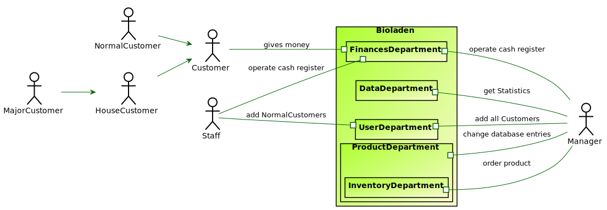

= Artefaktsammlung der Analysephase

In diesem Ordner sind alle in der Analysephase erstellten Diagramme als Bild und zusätzlich das zugrundeliegende Modell zu hinterlegen.

---

## CRC Karten
*link:http://st.inf.tu-dresden.de/files/teaching/ss18/st/OOSE/OOSE_CRC_R-CRC.pdf[Zum Nachlesen]*

## Kontextdiagramm
*link:http://st.inf.tu-dresden.de/files/teaching/ss14/st/slides/32-st-context-model-features-2x2.pdf[Zum Nachlesen]*

image::ContextDiagram.svg[]

## Toplevel Architektur
*link:http://st.inf.tu-dresden.de/files/teaching/ss14/st/slides/32-st-context-model-features-2x2.pdf[Zum Nachlesen]*

## Anwendungsfalldiagramm
image::UseCase.svg[]

## GUI Entwurf
*link:https://st.inf.tu-dresden.de/Lehre/WS08-09/st1/Vorlesungen/21-datadriven-analysis-with-uml-1x2.pdf[Zum Nachlesen]*

## Klassenanalysediagramm
*link:https://st.inf.tu-dresden.de/Lehre/WS08-09/st1/Vorlesungen/21-datadriven-analysis-with-uml-1x2.pdf[Zum Nachlesen]*

image::ClassAnalysisDiagram.svg[]

## Sequenzdiagramme

[[Sequenzdiagramm1]]
image::SequenceDiagrams/SequenceDiagram1.svg[title="Sequenzdiagramm für den Einkauf mit Pfandrückgabe"]

[[Sequenzdiagramm2]]
image::SequenceDiagrams/SequenceDiagram2.svg[title="Sequenzdiagramm für das Erstellen von Merklisten"]

[[Sequenzdiagramm3]]
image::SequenceDiagrams/SequenceDiagram3.svg[title="Sequenzdiagramm für das Nachbestellen mit dem OrderAssistent"]

[[Sequenzdiagramm4]]
image::SequenceDiagrams/SequenceDiagram4.svg[title="Sequenzdiagramm für das Hinzufügen von Produkten zur OrderableProducts Liste"]

[[Sequenzdiagramm5]]
image::SequenceDiagrams/SequenceDiagram5.svg[title="Sequenzdiagramm für das Hinzufügen von Kunden und das Bearbeiten des Kundentyps"]

