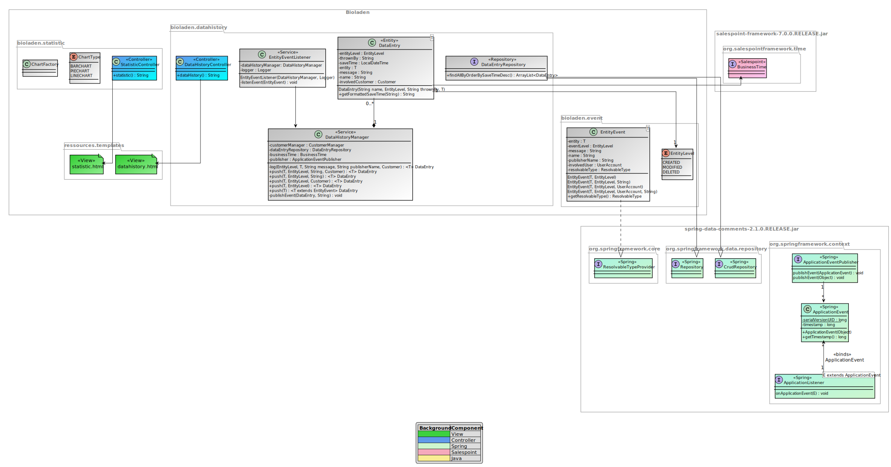
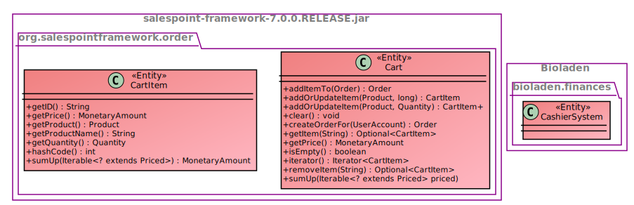
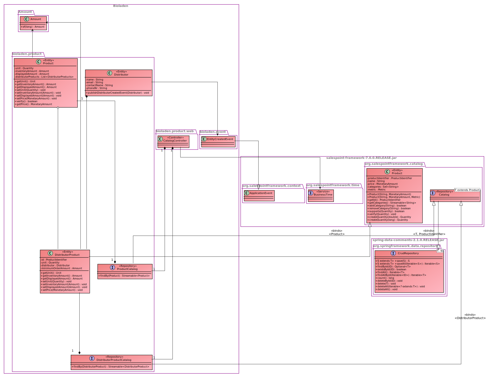
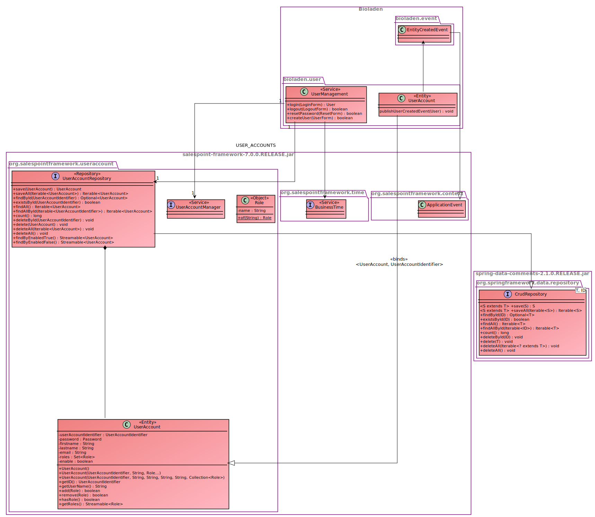
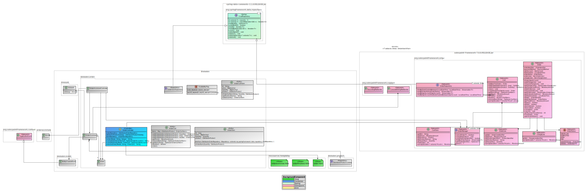

:toc:
:toclevels: 3
:toc-title: Inhaltsverzeichnis
:toc-placement!:

= Artefaktsammlung der Entwurfsphase

In diesem Ordner sind alle in der Entwurfsphase erstellten Diagramme als Bild und zusätzlich das zugrundeliegende Modell zu hinterlegen.

toc::[]

== DataDepartment

== FinancesDepartment

== ProductDepartment

== UserDepartment

== OrderDepartment

