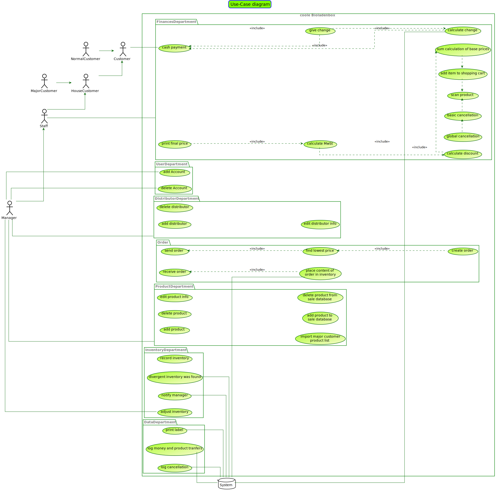
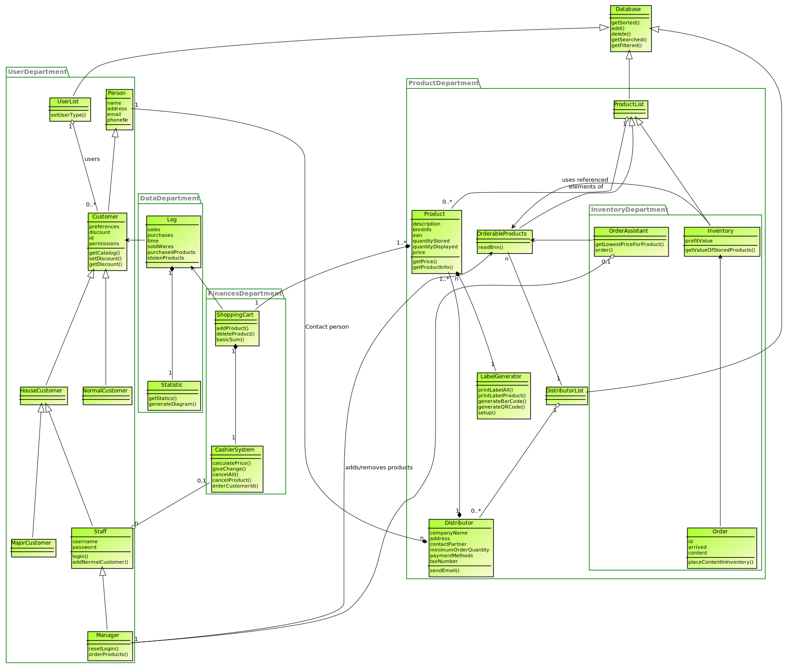

:doctype: book
:toc:
:toclevels: 3
:toc-title: Inhaltsverzeichnis
:toc-placement!:
:sectanchors:
:numbered:
:project_name: Bioladen

= Pflichtenheft __{project_name}__

[options="header"]
[cols="1, 1, 1, 1, 4"]
|===
|Version | Status      | Bearbeitungsdatum   | Autoren(en) |  Vermerk

|0.1
| In Arbeit
| 10.10.2017
| Autor
| Initiale Version

|0.1.1
| ...
| 23.10.2018
| Jairus, Lukas
| Inhaltsverzeichnis hinzugefügt

|0.1.2
| ...
| 23.10.2018
| Jairus, Lukas
| Diagramme hinzugefügt

|0.2
|...
|24.10.2018
|Lukas
|Zusammenfassung, Aufgabenstellung, Produktnutzung, Interessengruppen, testLabel

|===

toc::[]

== Zusammenfassung
In dem Pflichtenheft finden Sie die Aufgabenstellung sowie wichtige Modelle sowie den GUI Entwurf des Bioladens.
Außerdem werden die Anforderungen und die Ziele der Software hier spezifiziert.

== Aufgabenstellung und Zielsetzung
Für die Abwicklung unserer Geschäftsvorgänge ist ein Warenwirtschaftssystem zu
erstellen, welches verschiedene Datenbanken miteinander verknüpft.  +

So soll eine Einkaufsdatenbank alle lieferbaren Produkte unserer Zulieferer beinhalten.
Grundlage bildet dabei das BNN-Format, welches alle wichtigen Informationen zu den
Produkten vorsieht. Die entsprechenden Kataloge (mit bis zu 10000 Artikeln) können
durch Import von Listen der Grosshändler in die Datenbank gelangen. Beachten Sie
bitte, dass mehrere Grosshändler die gleichen Produkte führen, oft mit differierenden
Preisen. Da wir auch Produkte anbieten, die von Grosshändlern stammen, welche keine
Produktkataloge im BNN-Format zur Verfügung stellen, muss die manuelle Eingabe
weiterer Artikel mit für uns wesentlichen Produktinformationen möglich sein. Der
gesamte Bereich der Einkaufsdatenbank ist vor Einsichtnahme durch das
Verkaufspersonal zu schützen. +

Für die Organisation unserer Einkäufe und die Herstellung von Transparenz für die
Kunden ist eine Lieferantendatenbank notwendig. Diese bietet uns die Möglichkeit auf
Adressen, Telefonnummern, Ansprechpartner, Mindestbestellwerte, Zahlungsmodi,
Steuernummern usw. zurückzugreifen. Der Zugriff auf die Lieferantendatenbank ist für
das Verkaufspersonal nur eingeschränkt zu ermöglichen (Lieferantenname, Ort). +

Da wir eine Vielzahl Kunden bedienen, die unterschiedliche Konditionen erhalten,
benötigt unser Warenwirtschaftssystem auch eine Kundendatei. Diese soll die
Zuordnung der Kunden zu Gruppen ermöglichen (Normalkunden, Personal,
Großhandelsabnehmer, Hauskunden). Ferner soll die Kundendatei für Marketingzwecke
e-mail-Adressen, Wohn- bzw. Geschäftsadresse, Telefonnummern und die Vorliebe für
bestimmte Produkte bereithalten. Die Eingabe von Normalkundendaten ist für das
Verkaufspersonal möglich. Alle anderen Kundenzuordnungen erfolgen durch die
Geschäftsleitung. +

Kernstück des Warenwirtschaftssystems ist die Verkaufsdatenbank. Die von uns für den
Verkauf aus der Einkaufsdatenbank ausgewählten Artikel finden hier ihren Platz.
Beachten Sie bitte, dass diese zur Verarbeitung des alltäglichen Verkaufs nicht alle
lieferbaren Produkte umfassen muss. Priorität hat der schnelle Zugriff auf die Artikel (bis
zu 999). Für die Verkaufsdatenbank müssen die Preise für unterschiedliche
Kundengruppen kalkuliert werden. Für die Zeitersparnis bei der Kalkulation der
Verkaufspreise soll global kalkuliert werden können. Ferner soll die Kalkulation für
unterschiedliche Warengruppen und einzelne Artikel möglich sein. Als geeignet für
letztere erweist sich eine Darstellung in einer Merkliste, in die die zu kalkulierenden
Artikel vor der Kalkulation nach unterschiedlichen Gesichtspunkten sortiert werden, um
anschliessend wiederum global kalkuliert werden zu können. Die Auswahl der Artikel für
die Verkaufsdatenbank und die Kalkulation bleibt der Geschäftsleitung vorbehalten. Im
Handel allgemein und auch bei uns sind ausgewählte Produkte in Pfandartikeln verpackt.
Im Verkauf müssen also bestimmte Produkte mit Pfandartikeln verknüpft werden. +

Da wir der Preisauszeichnungspflicht unterworfen sind, soll unser
Warenwirtschaftssystem den Etikettendruck unterstützen. Ferner dienen Etiketten zurErfassung von Bestellvorgängen. Folgende Angaben sind dabei unabdingbar:
Produktname, Produktgrösse, Preis (für auszuwählende Kundengruppe),
Grundpreiseinheit, Grundpreis und EAN (Barcode). Nützlich sind Angaben, wie
Anbauverband (Bioland, Naturland, GÄA usw.), Lieferant, Sollstückzahl). +

Der wesentliche Bestandteil unseres Geschäftes besteht im Tausch von Produkten
gegen Bargeld mit unseren Kunden. Diese wählen einen Artikel aus, der durch den
Verkauf in deren Besitz übergeht. Entsprechend muss der jeweilige Artikel aus unserem
Bestand ausgebucht werden. Gleichzeitig bekommen wir dafür Bargeld, welches
unterschiedlichen Mehrwertsteuersätzen unterworfen ist. Auch dieses muss (nach
Steuersätzen getrennt) verbucht werden. Die Kassierfunktion unserer Warenwirtschaft
soll so einzelne oder mehrere Artikel erfassen. Dabei ist jede Waren- oder
Geldbewegung zu archivieren und einer einfachen statistischen Auswertung zugänglich
zu machen. Beachten Sie bitte, dass die Kassierfunktion sowohl die Addition von
Artikelwerten als auch die Subtraktion von zurückgegebenen Pfandwerten ermöglichen
muss. Auch die Multiplikation von Artikeln (etwa 6*Milch) sollte möglich sein. Nach
Eingabe aller vom Kunden gewünschter Artikel, wird der Verkaufsvorgang mit der
Bezahlung abgeschlossen. Um das Verkaufspersonal zu entlasten, ist es notwendig, die
Wechselgeldsumme unter Zuhilfenahme der vom Kunden übergebenen Summe durch
die Kasse zu berechnen und anzuzeigen. Wird innerhalb eines unabgeschlossenen
Verkaufsvorganges eine Rückbuchung vorgenommen, so handelt es sich dabei um eine
einfache Stornierung. Eine globale Stornierung — etwa, weil ein Kunde kein Geld bei
sich hat — sollte ebenfalls schnell möglich sein. Jegliche Stornierungen müssen
archiviert werden. +

Für die Feststellung der sich im Laden befindlichen Werte sind Inventuren notwendig.
Ein Wertvergleich von eingekaufter Ware, die bei Lieferung eingebucht wird, verkaufter
Ware und bei der Inventur vorhandener Ware liefert Inventurdifferenzen, die
aussagekräftig für Diebstahlsaufkommen sind. Zudem ist die Feststellung des
Warenwertes zum Wechsel des Wirtschaftsjahres vorgeschrieben. +

Der Bestellvorgang erfolgt für alle im Laden befindlichen Artikel auf einmal.
Anschliessend werden die Bestellungen für die einzelnen Anbieter ausgegeben. Die
Einkaufshilfe unseres Warenwirtschaftssystems ermöglicht es für gleiche Produkte von
unterschiedlichen Grosshändlern den günstigsten Anbieter auszuwählen. +

Als Zusatzaufgabe möchten wir wesentliche Erfassungen (Einbuchung bei
Wareneingang, Kassierfunktion, Inventuren) über einen Barcodescanner realisiert
wissen.

Ziele der Software:

- Produktkatalog für den Kunden im Web
- Verwaltungssystem für:
    * Angestellte
    * Bestellungen
    * Kunden
    * Verkäufe
    * Statistiken
- Repräsentation des Laden durch ein ansprechendes und intuitives Design im Web

== Produktnutzung
Das System wird hauptsächlich für die Verwaltung eines Bioladens genutzt.
Zusätzlich repräsentiert die Software den Laden auch im Web.

Dabei wird das System auf den Geräten im Bioladen laufen und im Internet(über den Browser) für die Kunden.
Das System wird dabei für die neueste Version folgender Browser optimiert, worüber es erreichbar ist:

- Mozilla Firefox
- Google Chrome

Die Nutzer, die das System am häufigsten nutzen werden, sind alle Leute, die sich über die Produkte des Bioladens informieren wollen.
Dabei wird nur typische Website Navigation vorausgesetzt.

Das Verkaufspersonal muss mit dem Umgang mit dem System vertraut gemacht werden, um an der Kasse effektiv arbeiten zu können.
Spezielle Vorkenntnisse sind hier aber auch nicht erforderlich.

Der Manager wird auch mit dem System vertraut gemacht und braucht auch keine weitere technische Erfahrung.

Alle Daten werden persistent in einer Datenbank gespeichert, wobei kein SQL Wissen vom Manager nötig ist.

== Interessensgruppen (Stakeholders)
Hier ist jede Gruppe gelistet, die irgendeinen Einfluss auf das Projekt hat.
Die Priorität 1-5 (niedrig-hoch) soll bei sich überschneidenden Zielen eine Entscheidungshilfe bieten.

[options="header"]
[cols="1,2,3,4"]
|===
|Name  |Priorität  |Beschreibung  |Ziele
|Manager des Bioladens  |5  |Der primäre Kunde des Projekts  | - Mehr Kunden anlocken +
- Vereinfacht den Prozess von Bestellungen, Inventur, Verkaufen, Nutzerverwaltung, etc.
|Kunden |3 |Sehen das System nur im Internet. Agieren sonst nicht direkt mit System. | - Gute Benutzer Erfahrung +
- Einfach zu bedienende Oberfläche im Browser
|Entwickler |3 |Leute, die das System entwicklen | - Einfache Erweiterbarkeit +
- Wenig Wartungsaufwand
|===

== Systemgrenze und Top-Level-Architektur

=== Kontextdiagramm
Das link:++https://github.com/st-tu-dresden-praktikum/swt18w43/blob/model/src/main/asciidoc/models/analysis/ContextDiagram.svg++[Kontextdiagramm] zeigt das geplante Software-System in seiner Umgebung. Zur Umgebung gehören alle Nutzergruppen des Systems und Nachbarsysteme. Die Grafik kann auch informell gehalten sein. Überlegen Sie sich dann geeignete Symbole. Die Grafik kann beispielsweise mit Visio erstellt werden. Wenn nötig, erläutern Sie diese Grafik.

=== Top-Level-Architektur
Dokumentieren Sie ihre link:++https://github.com/st-tu-dresden-praktikum/swt18w43/blob/model/src/main/asciidoc/models/analysis/TopLevelArchitecture.svg++[Top-Level-Architektur] mit Hilfe eines Komponentendiagramm.

image::models/analysis/TopLevelArchitecture.svg[]

== Anwendungsfälle

=== Akteure

Akteure sind die Benutzer des Software-Systems oder Nachbarsysteme, welche darauf zugreifen. Dokumentieren Sie die Akteure in einer Tabelle. Diese Tabelle gibt einen Überblick über die Akteure und beschreibt sie kurz. Die Tabelle hat also mindestens zwei Spalten (Akteur Name und Kommentar).
Weitere relevante Spalten können bei Bedarf ergänzt werden.

// See http://asciidoctor.org/docs/user-manual/#tables
[options="header"]
[cols="1,4"]
|===
|Name |Beschreibung
|...  |...
|===

=== Überblick Anwendungsfalldiagramm
link:++https://github.com/st-tu-dresden-praktikum/swt18w43/blob/model/src/main/asciidoc/models/analysis/UseCase.svg++[Anwendungsfall-Diagramm], das alle Anwendungsfälle und alle Akteure darstellt

=== Anwendungsfallbeschreibungen
Dieser Unterabschnitt beschreibt die Anwendungsfälle. In dieser Beschreibung müssen noch nicht alle Sonderfälle und Varianten berücksichtigt werden. Schwerpunkt ist es, die wichtigsten Anwendungsfälle des Systems zu finden. Wichtig sind solche Anwendungsfälle, die für den Auftraggeber, den Nutzer den größten Nutzen bringen.
Für komplexere Anwendungsfälle ein UML-Sequenzdiagramm ergänzen.
Einfache Anwendungsfälle mit einem Absatz beschreiben.
Die typischen Anwendungsfälle (Anlegen, Ändern, Löschen) können zu einem einzigen zusammengefasst werden.

== Funktionale Anforderungen

=== Muss-Kriterien
Was das zu erstellende Programm auf alle Fälle leisten muss.

=== Kann-Kriterien
Anforderungen die das Programm leisten können soll, aber für den korrekten Betrieb entbehrlich sind.

== Nicht-Funktionale Anforderungen

=== Qualitätsziele

Dokumentieren Sie in einer Tabelle die Qualitätsziele, welche das System erreichen soll, sowie deren Priorität.

=== Konkrete Nicht-Funktionale Anforderungen

Beschreiben Sie Nicht-Funktionale Anforderungen, welche dazu dienen, die zuvor definierten Qualitätsziele zu erreichen.
Achten Sie darauf, dass deren Erfüllung (mindestens theoretisch) messbar sein muss.

== GUI Prototyp

In diesem Kapitel soll ein Entwurf der Navigationsmöglichkeiten und Dialoge des Systems erstellt werden.
Idealerweise entsteht auch ein grafischer Prototyp, welcher dem Kunden zeigt, wie sein System visuell umgesetzt werden soll.
Konkrete Absprachen - beispielsweise ob der grafische Prototyp oder die Dialoglandkarte höhere Priorität hat - sind mit dem Kunden zu treffen.

image::GUI_Entwurf/startseite.png[]

image::GUI_Entwurf/produktuebersicht_kunde.png[]

image::GUI_Entwurf/produktinfo.png[]

image::GUI_Entwurf/merkliste.png[]

image::GUI_Entwurf/loginstart.png[]

image::GUI_Entwurf/login.png[]

image::GUI_Entwurf/produktuebersicht.png[]

image::GUI_Entwurf/verwaltung.png[]

image::GUI_Entwurf/user_hinzufuegen.png[]

image::GUI_Entwurf/user_verwalten.png[]

image::GUI_Entwurf/bnn.png[]

image::GUI_Entwurf/produkt_manuell.png[]

image::GUI_Entwurf/kasse.png[]

image::GUI_Entwurf/bestellung.png[]

image::GUI_Entwurf/statistik.png[]

Hier ist ein Entwurf für die Etiketten:

image::testLabel.svg[]
Hinweis: Zur vollständig korrekten Anzeige wird die Schriftart „Lato“ benötigt

=== Überblick: Dialoglandkarte
Erstellen Sie ein Übersichtsdiagramm, das das Zusammenspiel Ihrer Masken zur Laufzeit darstellt. Also mit welchen Aktionen zwischen den Masken navigiert wird.
//Die nachfolgende Abbildung zeigt eine an die Pinnwand gezeichnete Dialoglandkarte. Ihre Karte sollte zusätzlich die Buttons/Funktionen darstellen, mit deren Hilfe Sie zwischen den Masken navigieren.

=== Dialogbeschreibung
Für jeden Dialog:

1. Kurze textuelle Dialogbeschreibung eingefügt: Was soll der jeweilige Dialog? Was kann man damit tun? Überblick?
2. Maskenentwürfe (Screenshot, Mockup)
3. Maskenelemente (Ein/Ausgabefelder, Aktionen wie Buttons, Listen, …)
4. Evtl. Maskendetails, spezielle Widgets

== Datenmodell

=== Überblick: Klassendiagramm
link:++https://github.com/st-tu-dresden-praktikum/swt18w43/blob/model/src/main/asciidoc/models/analysis/ClassAnalysisDiagram.svg++[UML-Analyseklassendiagramm]

=== Klassen und Enumerationen
Dieser Abschnitt stellt eine Vereinigung von Glossar und der Beschreibung von Klassen/Enumerationen dar. Jede Klasse und Enumeration wird in Form eines Glossars textuell beschrieben. Zusätzlich werden eventuellen Konsistenz- und Formatierungsregeln aufgeführt.

// See http://asciidoctor.org/docs/user-manual/#tables
[options="header"]
|===
|Klasse/Enumeration |Beschreibung |
|…                  |…            |
|===

== Akzeptanztestfälle
Mithilfe von Akzeptanztests wird geprüft, ob die Software die funktionalen Erwartungen und Anforderungen im Gebrauch erfüllt. Diese sollen und können aus den Anwendungsfallbeschreibungen und den UML-Sequenzdiagrammen abgeleitet werden. D.h., pro (komplexen) Anwendungsfall gibt es typischerweise mindestens ein Sequenzdiagramm (welches ein Szenarium beschreibt). Für jedes Szenarium sollte es einen Akzeptanztestfall geben. Listen Sie alle Akzeptanztestfälle in tabellarischer Form auf.
Jeder Testfall soll mit einer ID versehen werde, um später zwischen den Dokumenten (z.B. im Test-Plan) referenzieren zu können.

== Glossar
Sämtliche Begriffe, die innerhalb des Projektes verwendet werden und deren gemeinsames Verständnis aller beteiligten Stakeholder essentiell ist, sollten hier aufgeführt werden.
Insbesondere Begriffe der zu implementierenden Domäne wurden bereits beschrieben, jedoch gibt es meist mehr Begriffe, die einer Beschreibung bedürfen. +
Beispiel: Was bedeutet "Kunde"? Ein Nutzer des Systems? Der Kunde des Projektes (Auftraggeber)?

== Offene Punkte
Offene Punkte werden entweder direkt in der Spezifikation notiert. Wenn das Pflichtenheft zum finalen Review vorgelegt wird, sollte es keine offenen Punkte mehr geben.
