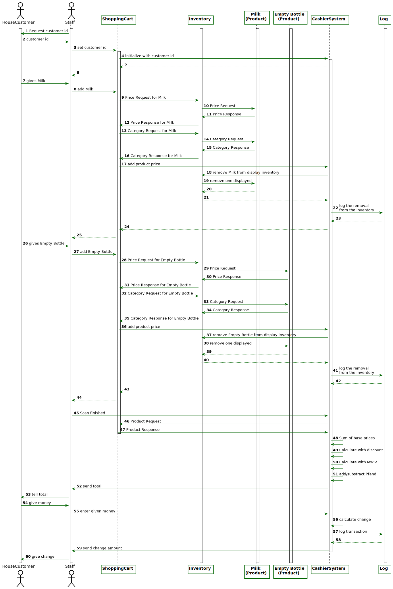
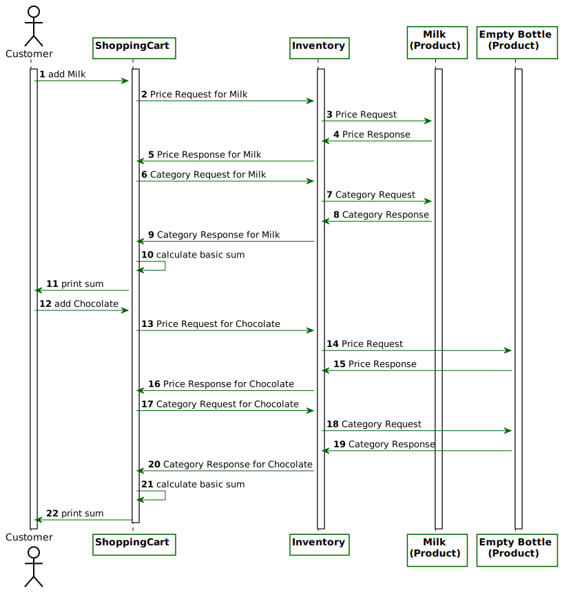
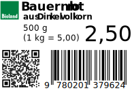
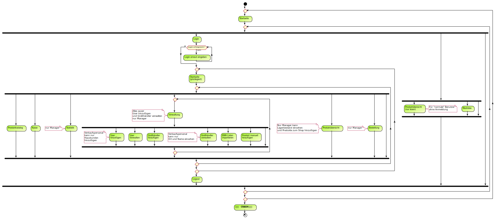

// SETTINGS \\

:doctype: book

// -- Table of Contents

:toc:
:toclevels: 3
:toc-title: Inhaltsverzeichnis
:toc-placement!:

// -- Icons

ifdef::env-github[]

:caution-caption: :fire:
:important-caption: :exclamation:
:note-caption: :paperclip:
:tip-caption: :bulb:
:warning-caption: :warning:
endif::[]

ifdef::env-github[]
:status:
:outfilesuffix: .adoc
endif::[]

:sectanchors:
:numbered:

// -- Variables
:project_name: Bioladen :seedling:

= Pflichtenheft __{project_name}__

[options="header"]
[cols="1, 1, 1, 1, 4"]
|===
|Version | Status      | Bearbeitungsdatum   | Autoren(en) |  Vermerk

|0.1
| In Arbeit
| 10.10.2017
| Autor
| Initiale Version

|0.1.1
| ...
| 23.10.2018
| Jairus, Lukas
| Inhaltsverzeichnis hinzugefügt

|0.1.2
| ...
| 23.10.2018
| Jairus, Lukas
| Diagramme hinzugefügt

|0.2
|...
|24.10.2018
|Lukas
|Zusammenfassung, Aufgabenstellung, Produktnutzung, Interessengruppen, testLabel

|0.2.1
|...
|25.10.2018
|Josi
|Akteure hinzugefügt

|0.2.2
|...
|25.10.2018
|Lisa
|GUI vollständig

|0.2.3
|...
|26.10.2018
|Lukas
|Muss- und Kannkriterien

|0.2.4
|...
|27.10.2018
|Lukas
|Nicht-Funktionale Anforderungen

|0.2.5
|...
|27.10.2018
|Lisa
|Dialoglandkarte und Beschreibung ; Klasse & Enumerations

|0.2.6
|...
|27.10.2018
|Lukas
|Muss- und Kannkriterien, Anwendungsfallbeschreibungen

|0.2.7
|...
|28.10.2018
|Lukas
|Glossar

|0.2.8
|...
|28.10.2018
|Josi
|Akzeptanztestfälle

|0.2.9
|...
|28.10.2018
|Jairus
|Überarbeitete Dialoglandkarte

|0.9
|...
|30.10.2018
|Lukas
|Einige kleine Verbesserungen

|1.0
|abgeschlossen
|31.10.2018
|Lukas, Lisa, Adrian, Jairus
|Akzeptanztestfälle für Fehlerfälle

|1.1
|...
|09.11.2018
|Lukas
|Template für Akzeptanztestfälle für Departments

|1.2
|...
|09.11.2018
|Lukas
|ATFD

|1.3
|...
|09.11.2018
|Lisa
|ATUD

|===

toc::[]

== Zusammenfassung
In dem Pflichtenheft finden Sie die Aufgabenstellung sowie wichtige Modelle sowie den GUI Entwurf des Bioladens.
Außerdem werden die Anforderungen und die Ziele der Software hier spezifiziert.

== Aufgabenstellung und Zielsetzung

Für die Abwicklung unserer Geschäftsvorgänge ist ein Warenwirtschaftssystem zu
erstellen, welches verschiedene Datenbanken miteinander verknüpft.  +

So soll eine Einkaufsdatenbank alle lieferbaren Produkte unserer Zulieferer beinhalten.
Grundlage bildet dabei das BNN-Format, welches alle wichtigen Informationen zu den
Produkten vorsieht. Die entsprechenden Kataloge (mit bis zu 10000 Artikeln) können
durch Import von Listen der Grosshändler in die Datenbank gelangen. Beachten Sie
bitte, dass mehrere Grosshändler die gleichen Produkte führen, oft mit differierenden
Preisen. Da wir auch Produkte anbieten, die von Grosshändlern stammen, welche keine
Produktkataloge im BNN-Format zur Verfügung stellen, muss die manuelle Eingabe
weiterer Artikel mit für uns wesentlichen Produktinformationen möglich sein. Der
gesamte Bereich der Einkaufsdatenbank ist vor Einsichtnahme durch das
Verkaufspersonal zu schützen. +

Für die Organisation unserer Einkäufe und die Herstellung von Transparenz für die
Kunden ist eine Lieferantendatenbank notwendig. Diese bietet uns die Möglichkeit auf
Adressen, Telefonnummern, Ansprechpartner, Mindestbestellwerte, Zahlungsmodi,
Steuernummern usw. zurückzugreifen. Der Zugriff auf die Lieferantendatenbank ist für
das Verkaufspersonal nur eingeschränkt zu ermöglichen (Lieferantenname, Ort). +

Da wir eine Vielzahl Kunden bedienen, die unterschiedliche Konditionen erhalten,
benötigt unser Warenwirtschaftssystem auch eine Kundendatei. Diese soll die
Zuordnung der Kunden zu Gruppen ermöglichen (Normalkunden, Personal,
Großhandelsabnehmer, Hauskunden). Ferner soll die Kundendatei für Marketingzwecke
e-mail-Adressen, Wohn- bzw. Geschäftsadresse, Telefonnummern und die Vorliebe für
bestimmte Produkte bereithalten. Die Eingabe von Normalkundendaten ist für das
Verkaufspersonal möglich. Alle anderen Kundenzuordnungen erfolgen durch die
Geschäftsleitung. +

Kernstück des Warenwirtschaftssystems ist die Verkaufsdatenbank. Die von uns für den
Verkauf aus der Einkaufsdatenbank ausgewählten Artikel finden hier ihren Platz.
Beachten Sie bitte, dass diese zur Verarbeitung des alltäglichen Verkaufs nicht alle
lieferbaren Produkte umfassen muss. Priorität hat der schnelle Zugriff auf die Artikel (bis
zu 999). Für die Verkaufsdatenbank müssen die Preise für unterschiedliche
Kundengruppen kalkuliert werden. Für die Zeitersparnis bei der Kalkulation der
Verkaufspreise soll global kalkuliert werden können. Ferner soll die Kalkulation für
unterschiedliche Warengruppen und einzelne Artikel möglich sein. Als geeignet für
letztere erweist sich eine Darstellung in einer Merkliste, in die die zu kalkulierenden
Artikel vor der Kalkulation nach unterschiedlichen Gesichtspunkten sortiert werden, um
anschliessend wiederum global kalkuliert werden zu können. Die Auswahl der Artikel für
die Verkaufsdatenbank und die Kalkulation bleibt der Geschäftsleitung vorbehalten. Im
Handel allgemein und auch bei uns sind ausgewählte Produkte in Pfandartikeln verpackt.
Im Verkauf müssen also bestimmte Produkte mit Pfandartikeln verknüpft werden. +

Da wir der Preisauszeichnungspflicht unterworfen sind, soll unser
Warenwirtschaftssystem den Etikettendruck unterstützen. Ferner dienen Etiketten zurErfassung von Bestellvorgängen. Folgende Angaben sind dabei unabdingbar:
Produktname, Produktgrösse, Preis (für auszuwählende Kundengruppe),
Grundpreiseinheit, Grundpreis und EAN (Barcode). Nützlich sind Angaben, wie
Anbauverband (Bioland, Naturland, GÄA usw.), Lieferant, Sollstückzahl). +

Der wesentliche Bestandteil unseres Geschäftes besteht im Tausch von Produkten
gegen Bargeld mit unseren Kunden. Diese wählen einen Artikel aus, der durch den
Verkauf in deren Besitz übergeht. Entsprechend muss der jeweilige Artikel aus unserem
Bestand ausgebucht werden. Gleichzeitig bekommen wir dafür Bargeld, welches
unterschiedlichen Mehrwertsteuersätzen unterworfen ist. Auch dieses muss (nach
Steuersätzen getrennt) verbucht werden. Die Kassierfunktion unserer Warenwirtschaft
soll so einzelne oder mehrere Artikel erfassen. Dabei ist jede Waren- oder
Geldbewegung zu archivieren und einer einfachen statistischen Auswertung zugänglich
zu machen. Beachten Sie bitte, dass die Kassierfunktion sowohl die Addition von
Artikelwerten als auch die Subtraktion von zurückgegebenen Pfandwerten ermöglichen
muss. Auch die Multiplikation von Artikeln (etwa 6*Milch) sollte möglich sein. Nach
Eingabe aller vom Kunden gewünschter Artikel, wird der Verkaufsvorgang mit der
Bezahlung abgeschlossen. Um das Verkaufspersonal zu entlasten, ist es notwendig, die
Wechselgeldsumme unter Zuhilfenahme der vom Kunden übergebenen Summe durch
die Kasse zu berechnen und anzuzeigen. Wird innerhalb eines unabgeschlossenen
Verkaufsvorganges eine Rückbuchung vorgenommen, so handelt es sich dabei um eine
einfache Stornierung. Eine globale Stornierung — etwa, weil ein Kunde kein Geld bei
sich hat — sollte ebenfalls schnell möglich sein. Jegliche Stornierungen müssen
archiviert werden. +

Für die Feststellung der sich im Laden befindlichen Werte sind Inventuren notwendig.
Ein Wertvergleich von eingekaufter Ware, die bei Lieferung eingebucht wird, verkaufter
Ware und bei der Inventur vorhandener Ware liefert Inventurdifferenzen, die
aussagekräftig für Diebstahlsaufkommen sind. Zudem ist die Feststellung des
Warenwertes zum Wechsel des Wirtschaftsjahres vorgeschrieben. +

Der Bestellvorgang erfolgt für alle im Laden befindlichen Artikel auf einmal.
Anschliessend werden die Bestellungen für die einzelnen Anbieter ausgegeben. Die
Einkaufshilfe unseres Warenwirtschaftssystems ermöglicht es für gleiche Produkte von
unterschiedlichen Grosshändlern den günstigsten Anbieter auszuwählen. +

Als Zusatzaufgabe möchten wir wesentliche Erfassungen (Einbuchung bei
Wareneingang, Kassierfunktion, Inventuren) über einen Barcodescanner realisiert
wissen.

Ziele der Software:

- Produktkatalog für den Kunden im Web
- Verwaltungssystem für:
    * Angestellte
    * Bestellungen
    * Kunden
    * Verkäufe
    * Statistiken
- Repräsentation des Laden durch ein ansprechendes und intuitives Design im Web

== Produktnutzung
Das System wird hauptsächlich für die Verwaltung eines Bioladens genutzt.
Zusätzlich repräsentiert die Software den Laden auch im Web.

Dabei wird das System auf den Geräten im Bioladen laufen und im Internet(über den Browser) für die Kunden.
Das System wird dabei für die neueste Version folgender Browser optimiert, worüber es erreichbar ist:

- Mozilla Firefox
- Google Chrome

Die Nutzer, die das System am häufigsten nutzen werden, sind alle Leute, die sich über die Produkte des Bioladens informieren wollen.
Dabei wird nur typische Website Navigation vorausgesetzt.

Das Verkaufspersonal muss mit dem Umgang mit dem System vertraut gemacht werden, um an der Kasse effektiv arbeiten zu können.
Spezielle Vorkenntnisse sind hier aber auch nicht erforderlich.

Der Manager wird auch mit dem System vertraut gemacht und braucht auch keine weitere technische Erfahrung.

Alle Daten werden persistent in einer Datenbank gespeichert, wobei kein SQL Wissen vom Manager nötig ist.

== Interessensgruppen (Stakeholders)
Hier ist jede Gruppe gelistet, die irgendeinen Einfluss auf das Projekt hat.
Die Priorität 1-5 (niedrig-hoch) soll bei sich überschneidenden Zielen eine Entscheidungshilfe bieten.

[options="header"]
[cols="1,2,3,4"]
|===
|Name  |Priorität  |Beschreibung  |Ziele
|Manager des Bioladens  |5  |Der primäre Kunde des Projekts  | - Mehr Kunden anlocken +
- Vereinfacht den Prozess von Bestellungen, Inventur, Verkaufen, Nutzerverwaltung, etc.

|Mitarbeiter |3 |Die Mitarbeiter im Laden -> Verkaufspersonal |- einfach zu bedienende Oberfläche der Kasse

|Kunden |3 |Sehen das System nur im Internet. Agieren sonst nicht direkt mit System. | - Gute Benutzer Erfahrung +
- Einfach zu bedienende Oberfläche im Browser

|Entwickler |3 |Leute, die das System entwicklen | - Einfache Erweiterbarkeit +
- Wenig Wartungsaufwand

|===

== Systemgrenze und Top-Level-Architektur

=== Kontextdiagramm
Das link:++https://github.com/st-tu-dresden-praktikum/swt18w43/blob/model/src/main/asciidoc/models/analysis/ContextDiagram.svg++[Kontextdiagramm] zeigt das geplante Software-System in seiner Umgebung. Zur Umgebung gehören alle Nutzergruppen des Systems und Nachbarsysteme. Die Grafik kann auch informell gehalten sein. Überlegen Sie sich dann geeignete Symbole. Die Grafik kann beispielsweise mit Visio erstellt werden. Wenn nötig, erläutern Sie diese Grafik.

image::models/analysis/ContextDiagram.svg[]

=== Top-Level-Architektur
Dokumentieren Sie ihre link:++https://github.com/st-tu-dresden-praktikum/swt18w43/blob/model/src/main/asciidoc/models/analysis/TopLevelArchitecture.svg++[Top-Level-Architektur] mit Hilfe eines Komponentendiagramm.

image::models/analysis/TopLevelArchitecture.svg[]

== Anwendungsfälle

=== Akteure

Akteure sind die Benutzer des Software-Systems oder Nachbarsysteme, welche darauf zugreifen. Dokumentieren Sie die Akteure in einer Tabelle. Diese Tabelle gibt einen Überblick über die Akteure und beschreibt sie kurz. Die Tabelle hat also mindestens zwei Spalten (Akteur Name und Kommentar).
Weitere relevante Spalten können bei Bedarf ergänzt werden.

// See http://asciidoctor.org/docs/user-manual/#tables
[options="header"]
[cols="1,4"]
|===
|Name |Beschreibung
|Kunden | Kunden interagieren mit dem System nur über die firmeneigene Website. Sie können die Produktliste der im Laden verfügbaren Produkte einsehen und sich zu den einzelnen Produkten
Produktinformationen anschauen. Sie können sich außerdem eine Merkliste erstellen, in der sie alle Produkte in der gewünschten Menge angeben können und das System ihnen
 einen daraufhin kalkulierten Gesamtpreis zurück gibt.
|Personal (Staff)| Das Personal interagiert mit dem System über die Kassenterminals im Bioladen. Es kann Waren zum Warenkorb hinzufügen und einen Gesamtpreis berechnen. Außerdem kann es Geld
kassieren und erfährt durch das System, wie viel Rückgeld der Kunde bekommt. Es kann außerdem Hauskunden zum System hinzufügen. Es hat außerdem beschränkten Zugriff auf die Lieferantendatenbank
(Lieferantenname, Ort). Das Personal kann außerdem einfache und globale Stornierungen vornehmen.
|Manager | Der Manager hat zusätzlich zu den Berechtigungen des Personals noch einige verwaltungstechnische Möglichkeiten. Er hat Zugriff auf einen Bestellassistenten, der ihm hilft
den günstigsten Preis für zu bestellende Produkte zu finden und beim Bestellvorgang unterstützt. Er bekommt außerdem eine Übersicht über die im Lager und im Laden gelagerten Produkte
und kann für die Inventur eine Liste bereitstellen. Wenn es bei dieser zu Abweichungen vom tatsächlichen Bestand kommt, kann er diesen aktualisieren. Er kann zusätzlich zu den
Hauskunden auch Großkunden und Personal verwalten (Neue hinzufügen, Daten aktualisieren, Kunden/Personal löschen).

|===

=== Überblick Anwendungsfalldiagramm
link:++https://github.com/st-tu-dresden-praktikum/swt18w43/blob/model/src/main/asciidoc/models/analysis/UseCase.svg++[Anwendungsfall-Diagramm], das alle Anwendungsfälle und alle Akteure darstellt

image::models/analysis/UseCase.svg[]

=== Anwendungsfallbeschreibungen
Dieser Unterabschnitt beschreibt die Anwendungsfälle. In dieser Beschreibung müssen noch nicht alle Sonderfälle und Varianten berücksichtigt werden. Schwerpunkt ist es, die wichtigsten Anwendungsfälle des Systems zu finden. Wichtig sind solche Anwendungsfälle, die für den Auftraggeber, den Nutzer den größten Nutzen bringen.
Für komplexere Anwendungsfälle ein UML-Sequenzdiagramm ergänzen.
Einfache Anwendungsfälle mit einem Absatz beschreiben.
Die typischen Anwendungsfälle (Anlegen, Ändern, Löschen) können zu einem einzigen zusammengefasst werden.

[options="header"]
[cols="^1h,3"]
|===

|ID
|UC0010
|Name
|Einkauf mit Pfandrückgabe

|Beschreibung
|Ein Kunde sollte einkaufen können und das Wechselgeld dabei erhalten. Außerdem muss der Einkauf geloggt werden

|Akteure
|Kunde, Verkaufspersonal

|Auslöser
|Kunde geht mit seinen Produkten zur Kasse

|Vorbedingungen
|Kunde hat sich Produkte ausgesucht, die er kaufen möchte

|Wichtigste Schritte
|1. Kunden ID wird eingegeben +
2. Waren werden eingescannt +
3. Alles wird geloggt +
4. Gesamtpreis wird berechnet +
5. Wechselgeld wird berechnet

|Erweitert
|Nur von Kunden mit Kundenkarte (Hauskunden) werden die Vorlieben gespeichert -> geloggt

|Funktionale Anforderung
|#F002, #F004, #F009, #F010, #F011, #F013, #F023

|===

[options="header"]
[cols="^1h,3"]
|===

|ID
|UC0020
|Name
|Erstellen von Merklisten

|Beschreibung
|Ein Kunde ist in der Lage online eine Merkliste zu erstellen. Dabei wird der Gesamtpreis der Artikel angezeigt. -> Allerdings ohne Bestellfunktion

|Akteure
|Kunde

|Auslöser
|Kunde fügt online ein Produkt seinem Merkzettel hinzu

|Vorbedingungen
|Kunde ist auf der Website

|Wichtigste Schritte
|1. Produkt hinzufügen +
2. Berechnung von allen Artikeln im Warenkorb +
3. Ausgeben der Summe der Preise von Artikeln im Warenkorb

|Erweitert
|keine

|Funktionale Anforderung
|#F008

|===

image::models/analysis/SequenceDiagrams/SequenceDiagram3.svg[title="Nachbestellen mit OrderAssistant"]

[options="header"]
[cols="^1h,3"]
|===

|ID
|UC0030
|Name
|Nachbestellen mit OrderAssistant

|Beschreibung
|Der Manager bestellt Produkte über den Einkaufsassistenten

|Akteure
|Manager

|Auslöser
|Manager klickt auf den Reiter Bestellung und füllt Felder mit Produktnamen und Anzahl aus

|Vorbedingungen
|Der Manager ist eingeloggt

|Wichtigste Schritte
|1. Manager gibt Produkte und Anzahl ein +
2. Mindestbestellmenge wird überprüft und der günstigste Preis ausgegeben
3. Manager sucht sich das Angebot seiner Wahl aus
4. Einkaufshilfe sendet E-Mails an die Großhändler

|Erweitert
|Nur der Manager kann diese Funktion nach dem Einloggen benutzen

|Funktionale Anforderung
|#F001, #F021

|===

[options="header"]
[cols="^1h,3"]
|===

|ID
|UC0040
|Name
|Hinzufügen von Produkten zur OrderableProducts Liste

|Beschreibung
|Der Manager möchte neue Produkte hinzufügen über eine BNN-Liste und manuell

|Akteure
|Manager

|Auslöser
|Manager klickt auf "BNN Listen importieren" oder "Produkt manuell hinzufügen" im Verwaltungs-Reiter

|Vorbedingungen
|Der Manager ist eingeloggt

|Wichtigste Schritte
|1. Der Manager gibt eine BNN-Liste ein +
2. Der Manager gibt ein Produkt manuell ein +
3. Das Produkt wird zur Datenbank hinzugefügt

|Erweitert
|Nur der Manager kann diese Funktion nach dem Einloggen nutzen

|Funktionale Anforderung
|#F001, #F022

|===

[options="header"]
[cols="^1h,3"]
|===

|ID
|UC0050
|Name
|Hinzufügen eines Kunden und das Bearbeiten des Kundentyps

|Beschreibung
|Der Manager fügt einen neuen Kunden hinzu und legt dessen Typ fest

|Akteure
|Manager

|Auslöser
|Der Manager klickt auf "User hinzufügen" im Verwaltungs-Reiter

|Vorbedingungen
|Der Manager ist eingeloggt

|Wichtigste Schritte
|1. Manager gibt die Daten des neuen Kunden ein +
2. Manager legt den Typ des Kunden fest

|Erweitert
|Nur der Manager kann diese Funktion nach dem Einloggen nutzen

|Funktionale Anforderung
|#F001

|===

== Funktionale Anforderungen

=== Muss-Kriterien

[options="header"]
[cols="^1h,1,3"]
|===

|ID
|Name
|Beschreibung

|#F001
|Funktionen von Listen mit Daten: +
- Inventory +
- OrderableProducts +
- UserList +
- DistributorList
|- Sortieren +
- Suche +
- Hinzufügen +
- Entfernen

|#F002
|Archivierung
|Einkäufe, Verkäufe, Stornierungen, etc. müssen in einem Log archiviert werden

|#F003
|Bestand anzeigen
|Der aktuelle Bestand von Produkten im Lager muss dem Manager angezeigt werden

|#F004
|Speicherung von Vorlieben
|Es werden die Vorlieben von Hauskunden (Kunden mit Kundenkarte gespeichert)

|#F005
|Gewinnprozentsatz
|Der Manager kann den Prozentsatz für die Gewinnberechnung für die Produktpreise ändern

|#F006
|Ausstellungsfläche
|Es können nur 999 Produkte im Laden ausgestellt werden

|#F007
|Größe Einkaufsdatenbank
|Es können bis zu 10000 Artikel in der Einkaufdatenbank sein

|#F008
|Online Merkzettel
|Es gibt einen online Merkzettel für Kunden (ohne Bestellfunktion)

|#F009
|Entfernen von Produkten aus dem Inventar
|Produkte müssen aus dem Bestand entfernt werden, sobald sie im Warenkorb sind

|#F010
|Preiskalkulation
|Der endgültige Preis wird an der Kasse global kalkuliert. Dabei gibt es einen Rabatt für verschiedene Kundengruppen

|#F011
|Sortierung im Warenkorb
|Die Produkte im Warenkorb müssen nach Kategorien sortiert werden

|#F012
|Etiketterstellung
|- Pro Produkt muss ein Etikett erstellt werden +
- Man kann für alle Produkte auf einmal die Etikette drucken lassen

|#F013
|Informationen im Warenkorb
|Im Warenkorb wird Anzahl und Kilopreis von Produkten angezeigt

|#F014
|Steuerabgaben
|Steuerabgaben werden extra berechnet -> nicht in den Profit

|#F015
|Statistik
|Es muss eine statistische Auswertung in Tabellen und Diagrammen geben von: +
- Umsatz +
- Anzahl Verkäufe pro Tag +
- Diebstahl +
- Lagerbestand +
- Produktanteile +
- Neuanmeldungen Kunden

|#F016
|Stornierungen
|Es muss eine einfache und eine globale Stornierung an der Kasse möglich sein

|#F017
|Inventur
|Nach der Inventur muss der Lagerbestand wenn nötig angepasst werden können

|#F018
|Wirtschaftsjahr
|Es muss nach Ende eines Wirtschaftsjahres der Warenwert festgestellt werden können

|#F019
|Lieferungsübersicht
|Es muss eine Übersicht von den bestellten Lieferungen geben

|#F020
|Lieferprobleme
|- Falls ein Lieferant nicht mehr liefert, müssen diese Produkte angepasst werden können +
- Es kann sein, dass Lieferungen Probleme haben und nicht ankommen. Die muss abgefangen werden

|#F021
|Mindestbestellmenge
|Es gibt eine Mindestbestellmenge für jedes Produkt bei Händlern

|#F022
|Produkte hinzufügen
|- Produkte können manuell hinzugefügt werden +
- Produkte können über eine BNN-Liste importiert werden

|#F023
|Pfand
|Kunden können Pfand abgeben

|#F024
|Anzahl ändern im Warenkorb
|Im Warenkorb muss die Anzahl einfach geändert werden können +
-> z.B. 6 mal ein Produkt

|===

=== Kann-Kriterien

[options="header"]
[cols="^1h,1,3"]
|===

|ID
|Name
|Beschreibung

|#F101
|Ablaufdatum
|Es gibt ein Ablaufdatum für Produkte

|#F102
|Sonderaktionen
|Es kann Sonderaktionen geben

|#F103
|Zurückhalten bei Stornierung
|Bei einer globalen Stornierung können die Produkte für den Kunden zurückgehalten werden

|#F104
|Mindestbestellwert
|Es gibt außerdem einen Mindestbestellwert bei Händlern

|#F105
|Produktvorschläge
|Es gibt Vorschläge für neue Produkte aufgrund von kürzlich gekauften

|#F106
|EMail Versand
|Der OrderAssistant kann automatisch EMails versenden

|===

== Nicht-Funktionale Anforderungen

=== Qualitätsziele

In der nachfolgenden Tabelle wird dokumentiert, welche Qualitätsziele von der Software erfüllt werden müssen.
Außerdem wird die Priorität der einzelnen Ziele festgehalten. (1 - unwichtig  ->  5 - sehr wichtig)

[options="header"]
[cols="2h,^1,^1,^1,^1,^1"]
|===
|Qualitätsziel
|1
|2
|3
|4
|5

|Wartbarkeit (Maintainability)
|
|
|X
|
|

|Erweiterbarkeit (Extensibility)
|
|
|
|
|X

|Benutzbarkeit (Usability)
|
|
|X
|
|

|Anpassbarkeit (Scalability)
|X
|
|
|
|

|Zuverlässigkeit (Reliability)
|
|
|
|
|X

|Sicherheit (Security)
|
|
|
|X
|

|Geschwindigkeit (Performance)
|
|
|
|X
|

|===

=== Konkrete Nicht-Funktionale Anforderungen

[options="header"]
[cols="1,2"]
|===

|Name
|Beschreibung

|Verfügbarkeit
|Das System sollte möglichst immer verfügbar sein, damit Verkäufe durch die Kasse abgeschlossen werden können und der Kunde online die Website sehen kann.
Dabei sollte das System mindestens 99,5% der Zeit verfügbar sein.

|Sicherheit
|Die Passwörter der Mitarbeiter (vor allem vom Manager) sollten gesichert sein (nur in Hash Werten gespeichert).

|Geschwindigkeit
|Das System sollte möglichst schnell sein, damit die vielen Produkte dem Nutzer in annehmbarer Zeit präsentiert werden können
und keine lange Wartezeiten an der Kasse auftreten.

|===

== GUI Prototyp

In diesem Kapitel befindet sich ein visueller Entwurf der Anwendnung, der die Navigations- und Dialog-Möglichkeiten darstellt

HINWEIS: Es handelt sich hier nur um einen Prototyp, daher können einige Funktionen und Layouts angepasst werden. + 
Die orangenen Sprechblasen sind Anmerkungen und werden später nicht zu sehen sein.

[[start_image]]

[[produktuebersicht_image]]

[[produktinfo_image]]
image::GUI_Entwurf/produktinfo.PNG[Produktinfo, 100%, 100%, pdfwidth=100%, title= "Produktinformationen für die einzelnen Produkte in {project_name}", align=center]

[[merkliste_image]]
image::GUI_Entwurf/merkliste.PNG[Merkliste, 100%, 100%, pdfwidth=100%, title= "Merkliste in {project_name}", align=center]

[[login_image]]

[[erfolgreicherlogin_image]]
image::GUI_Entwurf/login.PNG[Mangaer eingeloggt, 100%, 100%, pdfwidth=100%, title= "erfolgreicher Login für Manager in {project_name}", align=center]

[[produktuebersichtmanager_image]]
image::GUI_Entwurf/produktuebersicht.PNG[Produktübersicht, 100%, 100%, pdfwidth=100%, title= "Produktübersicht aus Sicht des Managers in {project_name}", align=center]

[[verwaltung_image]]
image::GUI_Entwurf/verwaltung.PNG[Verwaltung, 100%, 100%, pdfwidth=100%, title= "Verwaltungsübersicht in {project_name}", align=center]

[[userhin_image]]

[[userver_image]]

[[bnn_image]]
image::GUI_Entwurf/bnn.PNG[BNN, 100%, 100%, pdfwidth=100%, title= "Ganze Listen im BNN-Format importieren in {project_name}", align=center]

[[produktmanuell_image]]

[[kasse_image]]
image::GUI_Entwurf/kasse.PNG[Kasse, 100%, 100%, pdfwidth=100%, title= "Kassiersystem in {project_name}", align=center]

[[bestellung_image]]

[[statistik_image]]
image::GUI_Entwurf/statistik.PNG[Statistik, 100%, 100%, pdfwidth=100%, title= "Statistikübersicht in {project_name}", align=center]

[[testlabel_image]]

TIP: Zur vollständig korrekten Anzeige wird die Schriftart „Lato“ benötigt

=== Überblick: Dialoglandkarte
Übersichtsdiagramm, von welcher Seite man welche erreichen kann. Dabei wurde sich am GUI-Entwurf orientiert.

//Für jeden Dialog: Kurze textuelle Dialogbeschreibung eingefügt: Was soll der jeweilige Dialog? Was kann man damit tun? Überblick?- Maskenentwürfe (Screenshot, Mockup)-Maskenelemente (Ein/Ausgabefelder, Aktionen wie Buttons, Listen, …)-Evtl. Maskendetails, spezielle Widgets

[[dialog_image]]

=== Dialogbeschreibung
TIP: Die Spalte Figure bezieht sich auf die GUI
[options="header"]
[cols="^1h,2,3"]
|===
|Figure |Name  |Beschreibung  
|1  |Startseite des {project_name}  |Mithilfe der Navigationsleiste erreicht man die Produktübersicht, Merkliste und den Login für das Personal. Des Weiteren befindet sich nochmals ein größerer Button in der Mitte der Startseite, welche einen auch zur Produktübersicht bringt (für die intuitive Bedienung)
|2  |Produktübersicht für den Kunden  |Dort erhält der Kunde eine Übersicht, von allen Produkten, die zum Verkauf stehen. Mithilfe eines “Such”-Feldes, kann er nach speziellen Produkten su-chen. Außerdem kann er nach Kategorien und Preis sortieren. Mithilfe einer Checkbox, kann er gewünschte Artikel zur Merkliste hinzufügen (genaueres dazu bei Fig. 4). Klickt man links auf den Namen des Produktes, so kommt man zu der Produktinfo (siehe Fig. 3)+
Die Produktübersicht für das Personal (wenn dieser sich angemeldet hat) ent-hält außerdem die Option Label für Produkte zu drucken. Die Anzahl der Label kann man in kleine Felder (direkt hinter den Produkten) eingeben. Klickt das Personal auf den Button “alle”, so wird für jedes Produkt in der Liste die Anzahl der Labels auf 1 gesetzt. Mit dem Button “Auswahl drucken” wird die derzeitige Auswahl als PDF Datei generiert.
|3  |Produktinfo |Auf dieser Seite werden genauer Produktinformationen zu dem zuvor ange-klickten Produkt angezeigt. Mithilfe eines Buttons kann man jederzeit zur Pro-duktübersicht (2) zurückkehren.
|4  |Merkliste  |Hier erhält man eine Übersicht von allen Produkten, welche zuvor auf die Merkliste gesetzt wurden. Sollte diese leer sein, so befindet sich ein Informati-onstext auf dieser Seite, dass keine Produkte auf der Liste hinzugefügt worden.  Durch einen Klick auf den Button “Zurück zur Übersicht” kommt er, wie durch einen Klick auf die Navigationsleiste “Produktübersicht” zur “Produktübersicht”
In der Spalte Anzahl, kann der Nutzer die Anzahl seiner Produkte erhöhen. Es wird daraufhin eine Summe berechnet (evtl. Erst durch Hilfe des Buttons “Aktu-alisieren” aktualisiert). Sollte der Kunde ein Produkt komplett von der Merkliste streichen wollen, so kann er es mithilfe „von Merkliste entfernen“.
|5  |Login |Hier kann sich das Personal mit Hilfe seiner Daten in das System einloggen. Sollte dabei ein Fehler auftreten (Benutzer oder Passwort falsch), so erscheint eine Fehlermeldung unter den Eingabefeldern.
|6  |Erfolgreicher Login  |Sollte der Login erfolgreich sein, so wird die Person mit ihrem Namen begrüßt. Außerdem kann man sich nun auch ausloggen bzw. abmelden. In diesem Bei-spiel hat sich der Manager angemeldet. Daher hat er nun Zugriff zusätzlich auf Produktübersicht, Verwaltung, Kasse, Bestellung und Statistik in der Navigations-leiste. Sollte sich das Verkaufspersonal angemeldet haben, so hat dieser nur Zugriff auf Kasse und eingeschränkten Zugriff bei Verwaltung und Produktüber-sicht (mehr dazu unter Figure 8 und 7 ).
Loggt man per Navigationsleiste aus, so kommt man wieder zur Figure 1.
|7  |Produktübersicht im eingeloggten Zustand  |In der erweiterten Produktübersicht (hier aus Sicht des Managers) bleiben fast alle Features von Figure 2 erhalten, nur die Merkliste fällt weg. Für den Mana-gers kommt die Möglichkeit hinzu alle möglichen Produkte zu sehen und aus-zuwählen, welche Produkte für den Kunden sichtbar sind bzw. verkauft werden sollen. Dafür muss aber die Produkte im Lager vorhanden sein, deshalb kann der Manager den Lagebestand auch einsehen. Wie das Personal, hat der Mana-ger die Möglichkeit Labels zu generieren und die Kunden Produktinfos einzu-sehen (mehr dazu in Figure 2).
|8  |Verwaltungs-übersicht  |Dieses Bild zeigt einen Entwurf für die Verwaltungsübersicht für Personen und Produkten. Als Manager hat man vollen Zugriff auf die Verwaltung, d.h.  alle Optionen die in Figure 8 zu sehen sind. Die hier weißen dargestellten Buttons bringen den Manager zu der jeweilen Seite.
Das Verkaufspersonal sieht auf dieser Seite jedoch nur die Buttons: „User hin-zufügen“ und „Großhändler verwalten“.
|9  |Nutzer hinzufügen  |Auf dieser Seite kann das Personal neue Kundenkarteien erstellen.
Dafür sind die Eingaben: Geschlecht / Anrede , Vorname, Nachname, E-Mail, Telefonnummer und Kundenart. Wurde alles ausgefüllt, kann das Personal den Account mit dem Button „Account erstellen“. Danach werden die Textfelder zur Eingabe geleert.
Das Verkaufspersonal kann jedoch nur Hauskunden erstellen.
Diese Seite ist außerdem ähnlich zum „Großkunden hinzufügen“ und wurde deshalb nicht in einem extra Entwurf behandelt. Bei Großhändler fällt die Aus-wahlmöglichkeit der Kundenart weg.
Mit dem Button „Zurück zur Übersicht“ gelangt man wieder zur Figure 8.
|10 |Nutzer verwalten  |Der Manager hat hier die Möglichkeit alle Kundenkarteien zu sehen, zu sortie-ren nach verschiedenen Kriterien, diese zu löschen und das Passwort beim entsprechenden Personal zurückzusetzen, sollte dieser sein Passwort verges-sen haben. Ferner wird die User-ID links auch zu sehen sein.
Mit dem Button „Zurück zur Übersicht“ gelangt man wieder zur Figure 8.
|11 |BNN Listen im-portieren  |Sollte der Manger Produktlisten vom Großhändler bekommen, so kann er hier die Dateien importieren. 
|12 |Produkte manu-ell hinzufügen  |Ist keine BNN Liste vorhanden, kann der Manager Produkte mithilfe von Eingabefelder, wie auf dem Bild zu sehen, manuell eingeben und mit dem Button „Hinzufügen“ zur Produktdatenbank hinzufügen. Danach werden die Eingabefelder wieder geleert um eine schnellere manuelle Eingabe zu ermöglichen. 
|13 |Kasse  |Hier kann das Personal die Produkte, welche der Kunde kaufen möchte, abre-chen und damit vom Lagerbestand abziehen.
Links befindet sich dafür ein Eingabefeld für den Produktcode, darunter dafür ein Zahlenfeld. Rechts erhält das Personal eine Übersicht, über alle bereits hinzugefügten Waren. Mengen können direkt hinter den Produkten erhöht werden und gelöscht (einfach storniert) werden. Sollten alle Produkte gelöscht werden bzw. eine globale Stornierung erwünscht sein, gibt es dafür den Button „alles Löschen“. Die Kunden-ID kann auch mithilfe eines Eingabefeldes einge-geben werden. Unten rechts wird der Gesamtpreis ausgegeben. Mithilfe eines weiteren Eingabefeldes kann des erhaltenen Bargeldes eingeben werden vo-rauf daneben das entsprechende Rückgeld ausgegeben. 
|14 |Bestellsystem  |Mithilfe von zwei Eingabefeldern für Produktname und Menge, kann der Mana-ger nach Produkten suchen, die er Bestellen möchte. Nach der Eingabe werden die Such-Ergebnisse unterhalt in einer Tabelle ausgeben. Daraus kann sich der Manager seine gewünschten Produkte auswählen und zur Bestellübersicht hinzufügen. Mit dem Button „Bestellen“ werden die einzelnen Bestellungen an die Händler gesendet. 
|15 |Statistik  |Hier wird der Jahresumsatz, Gesamtlagerwert und weitere visuelle Statistiken für den Manager angezeigt.
|===

== Datenmodell

=== Überblick: Klassendiagramm
link:++https://github.com/st-tu-dresden-praktikum/swt18w43/blob/model/src/main/asciidoc/models/analysis/ClassAnalysisDiagram.svg++[UML-Analyseklassendiagramm]

image::models/analysis/ClassAnalysisDiagram.svg[]

=== Klassen und Enumerationen
Dieser Abschnitt stellt eine Vereinigung von Glossar und der Beschreibung von Klassen/Enumerationen dar. Jede Klasse und Enumeration wird in Form eines Glossars textuell beschrieben. Zusätzlich werden eventuellen Konsistenz- und Formatierungsregeln aufgeführt. +
TIP: für einfaches Verständis befinden sich hinter den englischsprachigen Begriffe die deutsche Übersetzung

// See http://asciidoctor.org/docs/user-manual/#tables
[options="header"]
|===
|Klasse/Enumeration |Beschreibung 
|Person                 |allgemeine Klasse für alle Person       
|Customer (Kunde)              |eine Art von Person      
|HouseCustomer (Hauskunde)        |eine spezielle Art vom Kunde , welche das Sytem nutzen (bekommen eigene Rabatte)  
|NormalCustomer (Normaler Kunde)                  |Art vom Kunden, welche auch als Laufkundschaft bezeichnet wird 
|MajorCustomer (Großabnehmer)        |Hauskunden, die große Menge an Produkten kaufen und daher einen anderen Rabatt bekommen         
|Staff (Personal )                  |Hauskunden mit Logindaten (eingeschränkte Zugriffsrechte) und Mitarbeiterrabatt (Hauskunden weil sie auch als Kunden einkaufen dürfen)
|Manager (Geschäftsleitung )                |Personal mit vollem Zugriff auf das System 
|UserList (Nutzerliste )                 |Übersicht aller gespreicherten Kunden und dessen Art
|Log    |speichert alle Verkäufe (Waren, Zeit etc.) und liefert damit alle für die Statistik benötigte Daten
|Statistic (Statistik )                 |gibt den Manager eine Übersicht über Gewinn, Wert der gelagerten Waren und verschiedener anderen Statistik in Diagramm 
|ShoppingCart (Einkaufswagen)   |dient zum hinzufügen von Waren , wird als  Merkliste genutzt und kann einfache summen daher berechnen
|CashierSystem (Kassen System)  |berechnet für das Verkaufspersonal den Gesamtpreis ( mit MWST und Rabatt), welche im Einkaufswagen liegen
|Product (Produkt)   |ein Teil der Produktliste, welche zum Einkaufswagen hinzugefügt werden kann
|ProductList (Produktliste) |Überklasse für Inventar und bestellbare Produkte, erbt von der Datenbank 
|Datebase (Datenbank )   |implementiert die  Suche und die eigentliche Datenbank 
|Inventory (Inventar)  |speichert die gelagerten Produkte 
|LabelGenerator (Etikettengenerator)  |erstellt Etiketten für Produkte, sowie Barcodes und QRCodes
|Distributor (Großhändler)  |einzelne Firma von den der {project_name} Produkte beziehen kann 
|DistributorList (Großhändler Liste)  |beinhaltet alle Großhändler 
|Order (Bestellung)  | speichert alle Bestellung und deren Status 
|OrderAssistant (Bestellungsassistent)  |hilft den Manager den günstigste Angebot bei den bestellbaren Produkten zu finden |
|===

== Akzeptanztestfälle
Mithilfe von Akzeptanztests wird geprüft, ob die Software die funktionalen Erwartungen und Anforderungen im Gebrauch erfüllt. Diese sollen und können aus den Anwendungsfallbeschreibungen und den UML-Sequenzdiagrammen abgeleitet werden. D.h., pro (komplexen) Anwendungsfall gibt es typischerweise mindestens ein Sequenzdiagramm (welches ein Szenarium beschreibt). Für jedes Szenarium sollte es einen Akzeptanztestfall geben. Listen Sie alle Akzeptanztestfälle in tabellarischer Form auf.
Jeder Testfall soll mit einer ID versehen werde, um später zwischen den Dokumenten (z.B. im Test-Plan) referenzieren zu können.

:uc_ref: Siehe <<Anwendungsfallbeschreibungen>>

[width="99%",cols="1,4",options="header"]
|===
|*ID* |*[AT0010]*
|Anwendungsfall |Einkauf mit Pfandrückgabe {uc_ref} 1
|Voraussetzung |Kunde sucht sich ein Produkt aus und geht zur Kasse
|Ereignis | Kunde gibt Kassierer Kundenkarte
|erwartetes Ergebnis | ID des Kunden wird gesetzt
|===
[width="99%",cols="1,4",options="header"]
|===
|*ID* |*[AT0011]*
|Anwendungsfall |Einkauf mit Pfandrückgabe {uc_ref} 1
|Voraussetzung |Kunde sucht sich ein Produkt aus und geht zur Kasse
|Ereignis | Kassierer scannt Produkt
|erwartetes Ergebnis | Kasse zeigt Preis für das Produkt und entsprechende Kategorie an, Produkt wird aus dem Bestand entfernt
|===
[width="99%",cols="1,4",options="header"]
|===
|*ID* |*[AT0012]*
|Anwendungsfall |Einkauf mit Pfandrückgabe {uc_ref} 1
|Voraussetzung |Kunde sucht sich ein Produkt aus und geht zur Kasse
|Ereignis | Kunde gibt Pfandflasche zurück
|erwartetes Ergebnis | Kasse zieht Pfandbetrag von Gesamtbetrag ab
|===
[width="99%",cols="1,4",options="header"]
|===
|*ID* |*[AT0013]*
|Anwendungsfall |Einkauf mit Pfandrückgabe {uc_ref} 1
|Voraussetzung |alle Waren des Kunden wurden eingescannt und alle Pfandflaschen zurückgegeben
|Ereignis | Kassierer beendet das Scannen
|erwartetes Ergebnis | System berechnet Gesamtbetrag, zieht Rabatte ab, kalkuliert MwSt., subtrahiert Pfand von Endpreis, Kasse zeigt Ergebnis an
|===
[width="99%",cols="1,4",options="header"]
|===
|*ID* |*[AT0014]*
|Anwendungsfall |Einkauf mit Pfandrückgabe {uc_ref} 1
|Voraussetzung |Gesamtbetrag des Einkaufes wurde dem Kunden genannt
|Ereignis | Kassierer gibt vom Kunden erhaltenen Betrag an
|erwartetes Ergebnis | System zieht vom erhaltenen Betrag den zu Zahlenden Betrag ab, Kasse zeigt Rückgeldbetrag an, Transaktion wird geloggt
|===
[width="99%",cols="1,4",options="header"]
|===
|*ID* |*[AT0015]*
|Anwendungsfall |Einkauf mit Pfandrückgabe {uc_ref} 1
|Voraussetzung |Rückgeld wurde ausgezahlt
|Ereignis | Kassierer beendet Einkaufsvorgang
|erwartetes Ergebnis | aktualisierte Vorlieben werden für Kundenkarte gespeichert, MwSt. wird von Gesamteinnahme gesondert, Einkauf wird geloggt
|===
[width="99%",cols="1,4",options="header"]
|===
|*ID* |*[AT0020]*
|Anwendungsfall |erstellen einer Merkliste auf der Website {uc_ref} 2
|Voraussetzung |Kunde besucht Website
|Ereignis | Kunde fügt Produkt seiner Merkliste hinzu
|erwartetes Ergebnis | Produkt wird Merkliste hinzugefügt, Preis wird angezeigt, Produkt wird unter entsprechende Kategorie geschrieben
|===
[width="99%",cols="1,4",options="header"]
|===
|*ID* |*[AT0021]*
|Anwendungsfall |erstellen einer Merkliste auf der Website {uc_ref} 2
|Voraussetzung |Kunde hat alle gewünschten Produkte zur Merkliste hinzugefügt
|Ereignis | Kunde drückt "aktualisieren"-Button
|erwartetes Ergebnis | Summe der Preise in der Merkliste wird addiert und ausgegeben, Anzahl aller Artikel in der Merkliste wird berechnet und ausgegeben
|===
[width="99%",cols="1,4",options="header"]
|===
|*ID* | *[AT0030]*
|Anwendungsfall | Nachbestellen mit OrderAssistant {uc_ref} 3
|Voraussetzung |Manager öffnet OrderAssistant
|Ereignis | Manager gibt Name und Anzahl des gewünschten Produktes an
|erwartetes Ergebnis | System sucht Produkte mit eingegebenem Namen und gibt eine Liste zurück, OrderAssistent berechnet Preise für gewünschte Menge, Orderassistent ermittelt
Mindestbestellmenge und Händler, OrderAssistant zeigt alle Produkte samt Händler und Mindestbestellmenge an, die für die Bestellung infrage kommen und gibt Empfehlung dazu
|===
[width="99%",cols="1,4",options="header"]
|===
|*ID* | *[AT0031]*
|Anwendungsfall | Nachbestellen mit OrderAssistant {uc_ref} 3
|Voraussetzung |Manager hat ein Ergebnis vom OrderAssistant vorgeschlagen bekommen
|Ereignis | Manager ändert Anzahl gewünschten Produktes
|erwartetes Ergebnis | OrderAssistant aktualisiert gewünschte Menge, berechnet Preis für gewünschte Menge neu, vergleicht erneut mit Mindestbestellmenge,
zeigt aktualisierte Liste mit möglichen Produkten samt Händler und Mindestbestellmenge an und gibt eine neue Empfehlung dazu
|===
[width="99%",cols="1,4",options="header"]
|===
|*ID* | *[AT0032]*
|Anwendungsfall | Nachbestellen mit OrderAssistant {uc_ref} 3
|Voraussetzung |Manager hat ein Ergebnis vom OrderAssistant vorgeschlagen bekommen
|Ereignis | Manager wählt bevorzugten Händler aus
|erwartetes Ergebnis | OrderAssistent fügt gewähltes Produkt in gewünschter Menge zur Bestelliste hinzu
|===
[width="99%",cols="1,4",options="header"]
|===
|*ID* | *[AT0033]*
|Anwendungsfall | Nachbestellen mit OrderAssistant {uc_ref} 3
|Voraussetzung |Manager hat alle gewünschten Produkte zur Bestellliste hinzugefügt
|Ereignis | Manager drückt auf "bestellen"
|erwartetes Ergebnis | OrderAssistent ordnet Bestellungen nach Händler, OrderAssistent sendet an jeden Händler, bei dem etwas bestellt wird, eine Email mit den
gewünschten Produkten
|===
[width="99%",cols="1,4",options="header"]
|===
|*ID* | *[AT0040]*
|Anwendungsfall | Hinzufügen von Produkten zur OrderableProducts Liste {uc_ref} 4
|Voraussetzung |Manager hat Produktliste von einem Händler in BNN-Format, Manager ist auf Verwaltungsseite
|Ereignis | Manager wählt Produktliste aus und klickt auf "importieren"
|erwartetes Ergebnis | Produkte werden einzeln initialisiert und zur Einkaufsdatenbank hinzugefügt
|===
[width="99%",cols="1,4",options="header"]
|===
|*ID* | *[AT0041]*
|Anwendungsfall | Hinzufügen von Produkten zur OrderableProducts Liste {uc_ref} 4
|Voraussetzung |Manager ist auf Verwaltungsseite
|Ereignis | Manager klickt auf "Produkt manuell hinzufügen" und gibt alle Daten zum Produkt an
|erwartetes Ergebnis | Produkt wird initialisiert und zur Einkaufsdatenbank hinzugefügt
|===
[width="99%",cols="1,4",options="header"]
|===
|*ID* | *[AT0050]*
|Anwendungsfall | Hinzufügen von Kunden und bearbeiten des Kundentyps {uc_ref} 5
|Voraussetzung |Manager ist auf User-Verwaltungsseite
|Ereignis | Manager klickt auf "User hinzufügen", gibt die geforderten Daten an und klickt auf "Account erstellen"
|erwartetes Ergebnis | User wird erstellt und samt Name, Adresse, Emailadresse, Telefonnummer in Kundenkartei abgespeichert
|===
[width="99%",cols="1,4",options="header"]
|===
|*ID* | *[AT0051]*
|Anwendungsfall | Hinzufügen von Kunden und bearbeiten des Kundentyps {uc_ref} 5
|Voraussetzung |Manager ist auf User-Verwaltungsseite und hat bereits einen neuen User erstellt
|Ereignis | Manager klickt "Kundentyp festlegen" und wählt aus, was für ein Kunde der User ist (Großkunde, Hauskunde, etc.)
|erwartetes Ergebnis | Dem User wird ein Kundentyp zugeordnet und eine ID wird erstellt
|===

=== Fehlerfälle

[width="99%",cols="1,4",options="header"]
|===

|ID
|[ATF010]

|Anwendungsfall
|Manager will sich einloggen

|Voraussetzung
|Manager befindet sich auf der Login Seite

|Ereignis
|Manager gibt falsches Passwort ein

|erwartetes Ergebnis
|Manager wird nicht eingeloggt -> Fehlermeldung erscheint

|===

[width="99%",cols="1,4",options="header"]
|===

|ID
|[ATF020]

|Anwendungsfall
|Verkaufspersonal gibt Produkt ID in das Kassensystem ein

|Voraussetzung
|Verkaufspersonal ist eingeloggt und befindet sich auf der Seite des Kassensystems

|Ereignis
|Verkaufspersonal gibt falsche Produkt ID ein

|erwartetes Ergebnis
|Fehlermeldung: Es wurde kein Produkt gefunden oder ein falsches Produkt hinzugefügt

|===

[width="99%",cols="1,4",options="header"]
|===

|ID
|[ATF030]

|Anwendungsfall
|Manager importiert eine BNN-Liste

|Voraussetzung
|Manager ist eingeloggt und befindet sich auf der Produkt hinzufügen Seite

|Ereignis
|Manager wählt falsche Datei aus

|erwartetes Ergebnis
|Fehlermeldung: Liste kann nicht importiert werden

|===

[width="99%",cols="1,4",options="header"]
|===

|ID
|[ATF031]

|Anwendungsfall
|Manager fügt neues Produkt manuell hinzu

|Voraussetzung
|Manager ist eingeloggt und befindet sich auf der Produkthinzufügen Seite

|Ereignis
|Manager gibt falschen Wert für ein Eingabefeld ein

|erwartetes Ergebnis
|Wert wird nicht akzeptiert, Fehlermeldung -> Nicht zulässigen Wert eingegeben

|===

[width="99%",cols="1,4",options="header"]
|===

|ID
|[ATF040]

|Anwendungsfall
|Manager fügt Artikel zur Ausstellungsfläche hinzu

|Voraussetzung
|Manager ist eingeloggt und befindet sich auf der Produktübersicht Seite

|Ereignis
|Manager wählt Produkt aus, welches im Lager nicht verfügbar ist

|erwartetes Ergebnis
|Produkt wird nicht hinzugefügt, Fehlermeldung -> Produkt nicht verfügbar

|===

=== ProductDepartment
[width="99%",cols="1,4",options="header"]
|===

|ID
|[ATPD010]

|Anwendungsfall
|

|Voraussetzung
|

|Ereignis
|

|erwartetes Ergebnis
|

|===

=== UserDepartment
[width="99%",cols="1,4",options="header"]
|===

|ID
|[ATUD011]

|Anwendungsfall
| neuer Kunde wird erstellt

|Voraussetzung
| Manager ist eingeloggt und befindet sich bei "User hinzufügen"

|Ereignis
| Manager füllt eine Felder aus und klickt auf "hinzufügen". Jedoch ist der Kunde bereits im System

|erwartetes Ergebnis
| Fehlermeldung, dass die eingegebenen Daten bereits im System sind

|===

[width="99%",cols="1,4",options="header"]
|===

|ID
|[ATUD012]

|Anwendungsfall
| neuer Kunde oder Mitarbeiter wird erstellt

|Voraussetzung
| Manager ist eingeloggt und befindet sich bei "User hinzufügen"

|Ereignis
| Manager füllt eine der Felder nicht aus oder nicht korrekt (z.B beim Namen dürfen keine Zahlen sein)

|erwartetes Ergebnis
| es wird kein neuer User hinzugefügt und eine Fehlermeldung erscheint, dass das Feld fehlerhaft aufgefüllt
ist bzw. nicht ausgefüllt wurde

|===

[width="99%",cols="1,4",options="header"]
|===

|ID
|[ATUD013]

|Anwendungsfall
| neuer Mitarbeiter wird erstellt

|Voraussetzung
| Manager ist eingeloggt und befindet sich bei "User hinzufügen"

|Ereignis
| Manager füllt alle Fehlder korrekt aus und wählt als Kundentyp "Mitarbeiter" aus

|erwartetes Ergebnis
| neuer Mitarbeiter wird erstellt und das Standardpasswort generiert und abgespeichert

|===

[width="99%",cols="1,4",options="header"]
|===

|ID
|[ATUD021]

|Anwendungsfall
| Manager muss Passwort von Mitarbeiter zurücksetzten

|Voraussetzung
| Manager befindet sich auf "User verwalten"

|Ereignis
| Manager klickt auf auf Passwort zurücksetzten für den entsprechenden Mitarbeiter

|erwartetes Ergebnis
|Das Passwort des ausgewählten Mitarbeiter wird auf ein Standardpasswort zurückgesetzt
(z.B Erster Buchstabe und des Vornamen + Nachname ; oder sowas wie 123Bioladen o.ä.)

|===

[width="99%",cols="1,4",options="header"]
|===

|ID
|[ATUD022]

|Anwendungsfall
| Manager muss Passwort von Mitarbeiter zurücksetzten

|Voraussetzung
| Manager befindet sich auf "User verwalten"

|Ereignis
| Manager klickt auf auf Passwort zurücksetzten , jedoch für einen Kunden

|erwartetes Ergebnis
| Da Kunden keine Zugangsrechte und damit auch kein Nutzeraccount,
 soll eine Fehlermeldung erscheinen, dass dieser kein Passwort besitzt, welchen zurück gesetzt werden kann.

|===

[width="99%",cols="1,4",options="header"]
|===

|ID
|[ATUD023]

|Anwendungsfall
| Manager muss Passwort von Mitarbeiter zurücksetzten

|Voraussetzung
| Manager befindet sich auf "User verwalten"

|Ereignis
| Manager klickt auf auf Passwort zurücksetzten für den entsprechenden Mitarbeiter,
 der bereits das Standardpasswort noch hat

|erwartetes Ergebnis
| Fehlermeldung: das Passwort ist bereits das Standartpasswort

|===

[width="99%",cols="1,4",options="header"]
|===

|ID
|[ATUD031]

|Anwendungsfall
| Personal möchte ein neues Passwort für seinen Account festlegen

|Voraussetzung
| er ist eingeloggt und befindet sich auf der Seite seiner Accountinformation

|Ereignis
| er trägt sein altes Passwort in das vorhergesehene Feld ein und
trägt zweimal richtig sein neuese Passwort ein und Button zum Passwort ändern wird getätigt

|erwartetes Ergebnis
| Passwort wird erfolgreich geändert

|===

[width="99%",cols="1,4",options="header"]
|===

|ID
|[ATUD032]

|Anwendungsfall
| Personal möchte ein neues Passwort für seinen Account festlegen

|Voraussetzung
| er ist eingeloggt und befindet sich auf der Seite seiner Accountinformation

|Ereignis
| Er trägt sein altes Passwort inkorrekt in das vorhergesehene Feld ein und
  trägt zweimal richtig sein neuese Passwort ein ODER ein Feld für das neue
  Passwort stimmt mit dem anderen nicht überein ODER ein oder mehr Felder worden
  nicht ausgefüllt. +
  Button zum Passwort ändern wird getätigt

|erwartetes Ergebnis
| Passwort wird nicht geändert, Fehlermeldung erscheint

|===

[width="99%",cols="1,4",options="header"]
|===

|ID
|[ATUD040]

|Anwendungsfall
| Manager möchte eine Kunden löschen

|Voraussetzung
| Manager ist eingeloggt und befindet sich auf "User verwalten"

|Ereignis
| Manager löscht mit Button den ausgewählten User

|erwartetes Ergebnis
| User verschwindet aus der Datenbank

|===

[width="99%",cols="1,4",options="header"]
|===

|ID
|[ATUD050]

|Anwendungsfall
| Manager sucht in der Datenbank nach Kunden

|Voraussetzung
| Manager ist eingeloggt und befindet sich auf "User verwalten"

|Ereignis
| Manager tippt einen Namen in das Suchfeld und klickt auf Suchen

|erwartetes Ergebnis
| Fall 1: der gesuchte Name wird in der Datenbank gefunden und alle Ergebnisse aufgelistet,
 +
Fall 2: wenn kein Ergebnis gefunden wird so wird angezeigt, dass keine Kunden unter dieser
Suchanfrage gefunden worde

|===

Weitere  Akzeptanztestfälle, welche zum UserDepartment gehören, findet man unter den ID'S
[AT0050],[AT0051] und [ATF010].

=== DataDepartment
[width="99%",cols="1,4",options="header"]
|===

|ID
|[ATDD010]

|Anwendungsfall
|

|Voraussetzung
|

|Ereignis
|

|erwartetes Ergebnis
|

|===

=== OrderDepartment
[width="99%",cols="1,4",options="header"]
|===

|ID
|[ATOD010]

|Anwendungsfall
|

|Voraussetzung
|

|Ereignis
|

|erwartetes Ergebnis
|

|===

=== FinancesDepartment

:AT_ref: Siehe <<Akzeptanztestfälle>>

[width="99%",cols="1,4",options="header"]
|===

|ID
|[ATFD010]

|Anwendungsfall
|Verkaufspersonal gibt vom Kunden erhaltene Summe ein

|Voraussetzung
|Scanvorgang abgeschlossen und Kunde bezahlt

|Ereignis
|Verkaufspersonal gibt Betrag ein, welcher kleiner als Summe der Produkte ist

|erwartetes Ergebnis
|Fehlermeldung: Nicht genügend Geld vom Kunden erhalten, Summe überprüfen

|===

[width="99%",cols="1,4",options="header"]
|===

|ID
|[ATFD020]

|Anwendungsfall
|Verkaufspersonal startet das Kassensystem

|Voraussetzung
|Verkaufspersonal befindet sich am Rechner für das Kassensystem

|Ereignis
|Verkaufspersonal gibt ungültigen UserAccount an

|erwartetes Ergebnis
|Kasse wird nicht gestartet, Fehlermeldung: Ungültiger User

|===

[width="99%",cols="1,4",options="header"]
|===

|ID
|[ATFD021]

|Anwendungsfall
|Verkaufspersonal startet das Kassensystem

|Voraussetzung
|Verkaufspersonal befindet sich am Rechner für das Kassensystem

|Ereignis
|Verkaufspersonal gibt UserAccount an, welcher bereits in eine Kasse eingeloggt ist

|erwartetes Ergebnis
|Kasse wird nicht gestartet, Fehlermeldung: User bereits an einer Kasse

|===

[width="99%",cols="1,4",options="header"]
|===

|ID
|[ATFD030]

|Anwendungsfall
|Stornierung eines Produktes (einfache Stornierung)

|Voraussetzung
|Es wurden Produkte an der Kasse eingescannt

|Ereignis
|Kunde möchte ein Produkt nicht mehr kaufen, Verkaufspersonal löscht Produkt aus Kassensystem

|erwartetes Ergebnis
|Produkt wird gelöscht, Preis neu berechnet, Produkt wieder Lager hinzugefügt

|===

[width="99%",cols="1,4",options="header"]
|===

|ID
|[ATFD031]

|Anwendungsfall
|Stornierung aller Produkte (globale Stornierung)

|Voraussetzung
|Es wurden Produkte an der Kasse eingescannt

|Ereignis
|Kunde möchte keine der Produkte mehr kaufen, Verkaufspersonal löscht alle

|erwartetes Ergebnis
|Alle Produkte werden entfernt, Kassensystem leer, Produkte wieder dem Lager hinzugefügt

|===

[width="99%",cols="1,4",options="header"]
|===

|ID
|[ATFD040]

|Anwendungsfall
|Löschen eines Produktes vom online Merkzettel

|Voraussetzung
|Kunde hat Produkte dem Merkzettel hinzugefügt

|Ereignis
|Kunde klickt auf Button um ein Produkt zu löschen

|erwartetes Ergebnis
|Produkt wird vom Merkzettel gelöscht, Preis wird neu berechnet

|===

[width="99%",cols="1,4",options="header"]
|===

|ID
|[ATFD041]

|Anwendungsfall
|Löschen von allen Produkten vom online Merkzettel

|Voraussetzung
|Kunde hat Produkte dem Merkzettel hinzugefügt

|Ereignis
|Kunde klickt auf Button um gesamtem Merkzettel zu löschen

|erwartetes Ergebnis
|Alle Produkte vom Merkzettel werden gelöscht, Merkzettel nun leer

|===

Für weitere Akzeptanztestfälle {AT_ref} [AT0010] [AT0011] [AT0012] [AT0013] [AT0014] [AT0015] [AT0020] [AT0021] [ATF020]

== Glossar
Das Glossar beinhaltet eine Liste mit Begriffen, die in diesem Projekt benutzt werden.
Dies wird erstellt um Missverständnissen vorzubeugen.

:domain_ref: Siehe <<Klassen und Enumerationen>>

[options="header"]
[cols="^1h,3"]
|===

|Begriff
|Beschreibung

|Kunde
|Ein Kunde ist eine Person, welche bei uns im Laden einkauft und die Website anschauen kann +
{domain_ref}

|Manager
|Der Manager ist eine Person, welche vollen Zugriff auf das System hat und administrative Aufgaben ausführen kann +
{domain_ref}

|Produkt
|Produkte werden verkauft, vom Manager von Großhändlern/Lieferanten eingekauft und auf der Website angezeigt +
{domain_ref}

|Bestellung
|Eine Bestellung wird vom Manager getätigt und an die Großhändler/Lieferanten gesendet, welche uns dann die Produkte senden +
{domain_ref}

|Großhändler
|Ein Großhändler bietet uns Produkte zum Kauf an +
{domain_ref}

|Lieferant
|Wird teilweise als Synonym für Großhändler genutzt

|Inventar
|Der Inventar zeigt an, wie viele Produkte sich momentan in unserem Lager befinden +
{domain_ref}

|Ausstellungsfläche
|Die Ausstellungsfläche gibt an, wie viele Produkte im Laden zum Verkauf angeboten werden (max. 999) +
{domain_ref}

|Personal
|Das Personal/Verkaufspersonal bedient die Kasse +
{domain_ref}

|System
|Allgemeiner Begriff für das Softwaresystem, welches implementiert wird

|Warenkorb
|Im Warenkorb werden die Produkte gespeichert, welche ein Kunde an der Kasse kaufen möchte +
{domain_ref}

|Merkliste
|Die Merkliste ist der Warenkorb auf der Website online, welche allerdings nicht zum Verkauf benutzt wird

|BNN Liste
|BNN Listen beinhalten Produkte nach dem BNN Standard, welche von unserem System eingelesen werden können

|===
